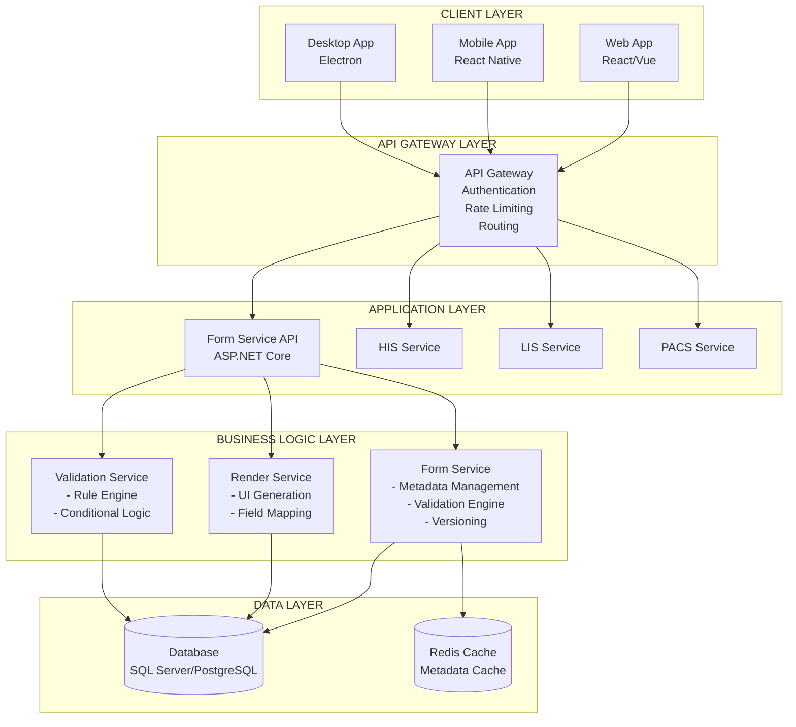
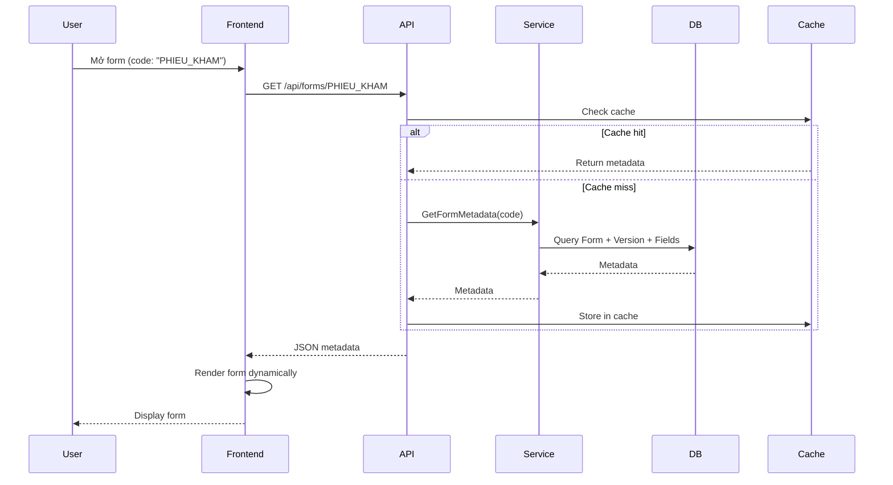
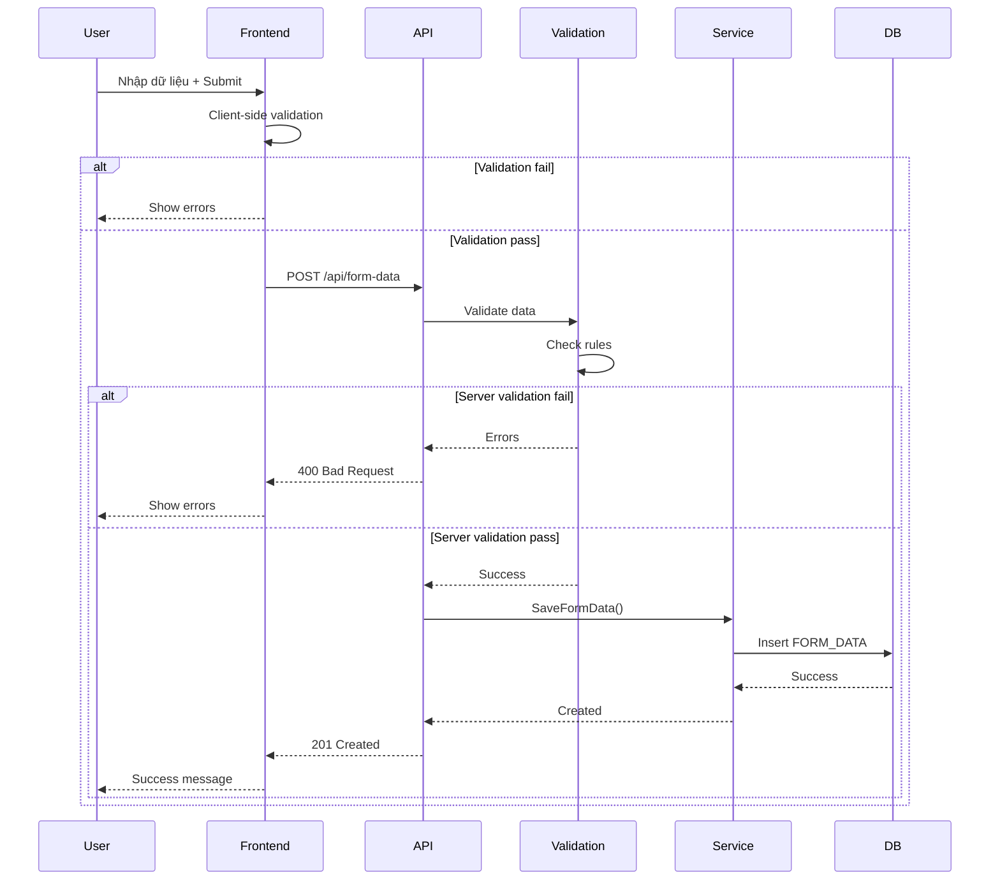
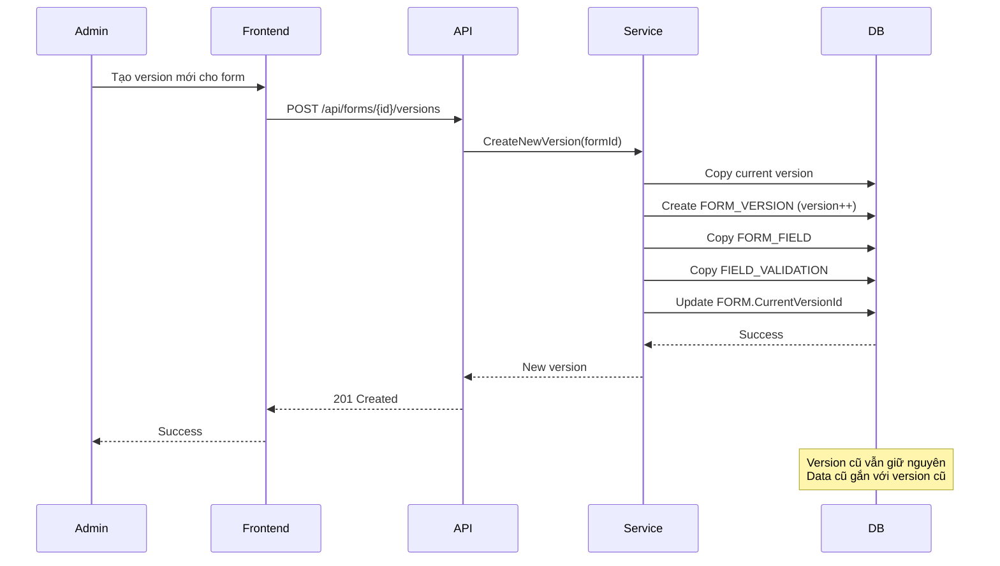
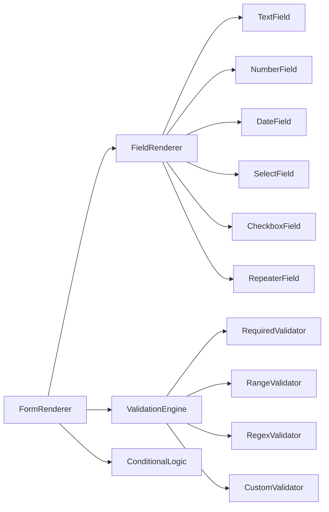
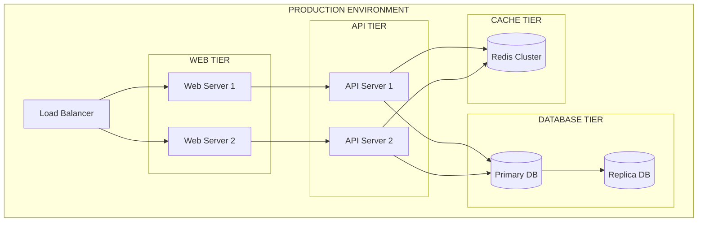
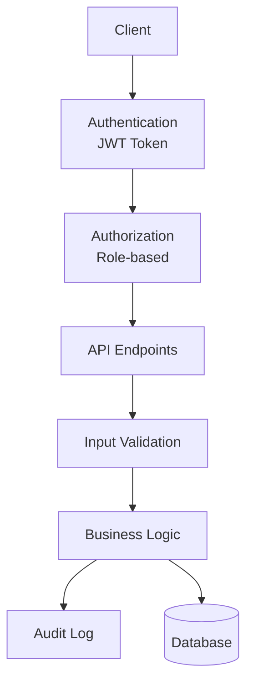

# SƠ ĐỒ KIẾN TRÚC HỆ THỐNG DYNAMIC FORM

## I. KIẾN TRÚC TỔNG QUAN

### 1.1 Sơ đồ kiến trúc tổng thể (System Architecture)



## II. LUỒNG XỬ LÝ CHÍNH

### 2.1 Luồng Render Form



### 2.2 Luồng Submit Form với Validation



### 2.3 Luồng Versioning



## III. KIẾN TRÚC CHI TIẾT

### 3.1 Backend Architecture (Layered Architecture)

```
┌─────────────────────────────────────────────────────────┐
│                    PRESENTATION LAYER                    │
│  ┌──────────────┐  ┌──────────────┐  ┌──────────────┐  │
│  │ Controllers  │  │  Middleware  │  │   Filters    │  │
│  └──────────────┘  └──────────────┘  └──────────────┘  │
└──────────────────────────────────────────────────────────┘
                          │
┌─────────────────────────────────────────────────────────┐
│                   APPLICATION LAYER                      │
│  ┌──────────────┐  ┌──────────────┐  ┌──────────────┐  │
│  │ FormService  │  │RenderService │  │ValidationSvc │  │
│  └──────────────┘  └──────────────┘  └──────────────┘  │
└──────────────────────────────────────────────────────────┘
                          │
┌─────────────────────────────────────────────────────────┐
│                     DOMAIN LAYER                         │
│  ┌──────────────┐  ┌──────────────┐  ┌──────────────┐  │
│  │  Entities    │  │  Interfaces  │  │ ValueObjects │  │
│  └──────────────┘  └──────────────┘  └──────────────┘  │
└──────────────────────────────────────────────────────────┘
                          │
┌─────────────────────────────────────────────────────────┐
│                    INFRASTRUCTURE LAYER                   │
│  ┌──────────────┐  ┌──────────────┐  ┌──────────────┐  │
│  │  Repository  │  │   UnitOfWork │  │    Cache     │  │
│  └──────────────┘  └──────────────┘  └──────────────┘  │
└──────────────────────────────────────────────────────────┘
                          │
                    ┌─────▼─────┐
                    │  Database │
                    └───────────┘
```

### 3.2 Frontend Architecture (Component-based)

```
┌─────────────────────────────────────────────────────────┐
│                    PRESENTATION LAYER                    │
│  ┌──────────────┐  ┌──────────────┐  ┌──────────────┐  │
│  │   Pages      │  │  Components  │  │    Layouts   │  │
│  └──────────────┘  └──────────────┘  └──────────────┘  │
└──────────────────────────────────────────────────────────┘
                          │
┌─────────────────────────────────────────────────────────┐
│                    BUSINESS LAYER                       │
│  ┌──────────────┐  ┌──────────────┐  ┌──────────────┐  │
│  │   Hooks      │  │   Services   │  │    Utils     │  │
│  └──────────────┘  └──────────────┘  └──────────────┘  │
└──────────────────────────────────────────────────────────┘
                          │
┌─────────────────────────────────────────────────────────┐
│                    DATA LAYER                            │
│  ┌──────────────┐  ┌──────────────┐  ┌──────────────┐  │
│  │  API Client  │  │   State Mgmt │  │    Cache     │  │
│  └──────────────┘  └──────────────┘  └──────────────┘  │
└──────────────────────────────────────────────────────────┘
```

## IV. COMPONENT DIAGRAM

### 4.1 Form Renderer Component



## V. DEPLOYMENT ARCHITECTURE



## VI. SECURITY ARCHITECTURE



## VII. CÁC PATTERN SỬ DỤNG

1. **Repository Pattern**: Tách biệt data access
2. **Unit of Work**: Quản lý transaction
3. **Service Layer**: Business logic
4. **DTO Pattern**: Data transfer objects
5. **Factory Pattern**: Tạo field renderer
6. **Strategy Pattern**: Validation rules
7. **Observer Pattern**: Form events
8. **Caching Pattern**: Metadata caching
