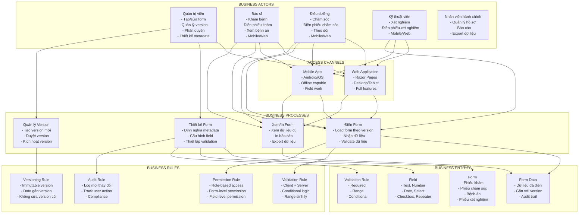
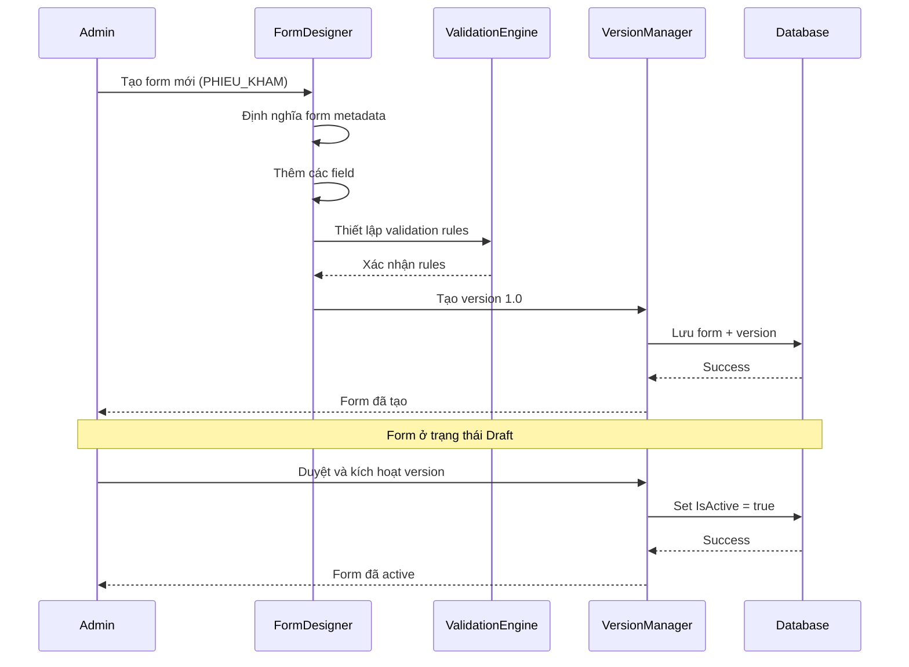
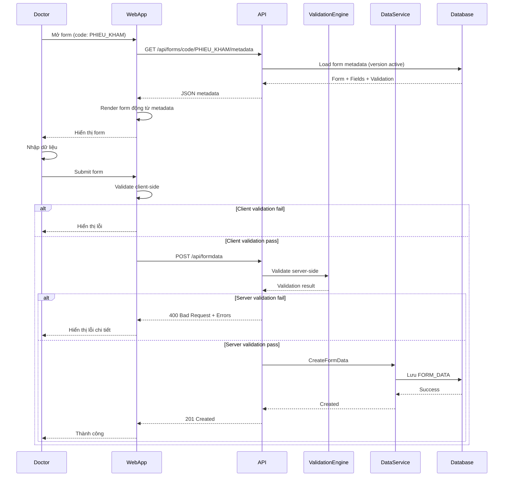
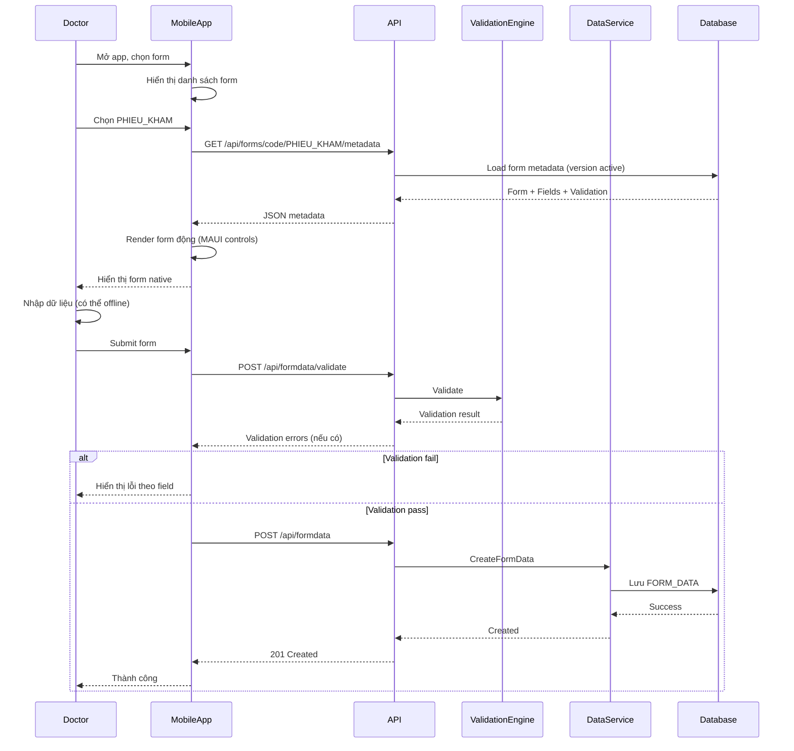
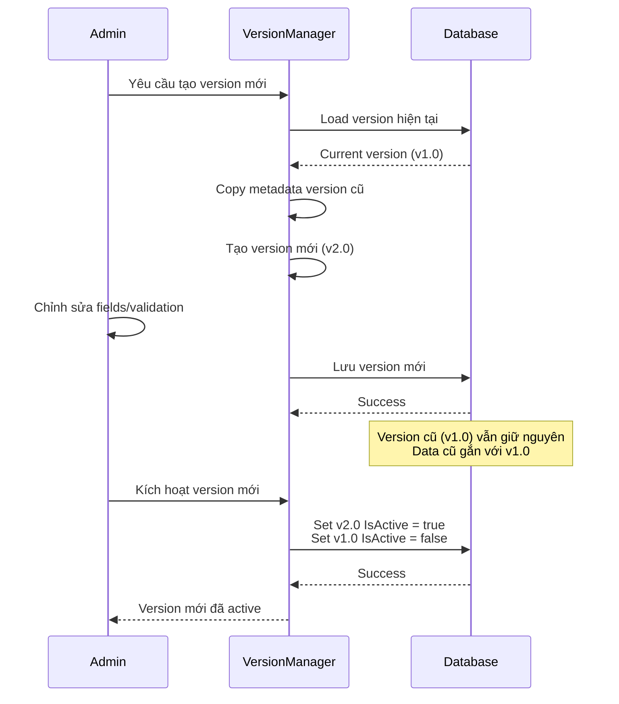
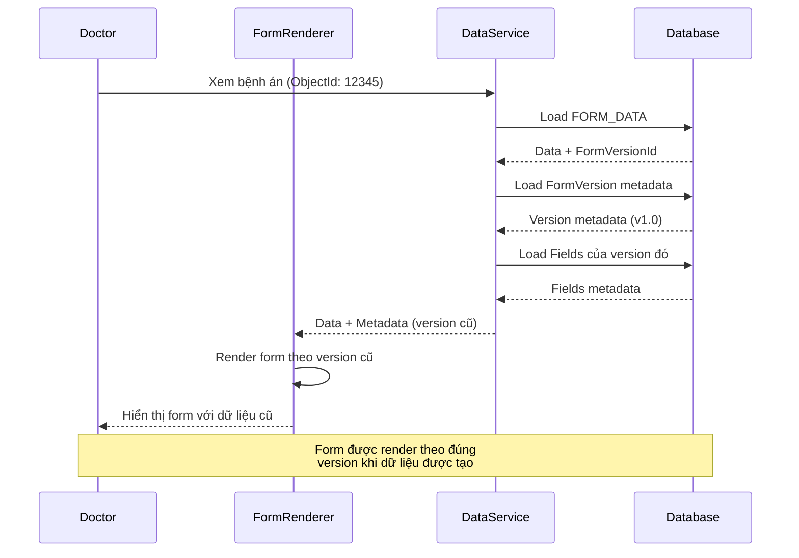
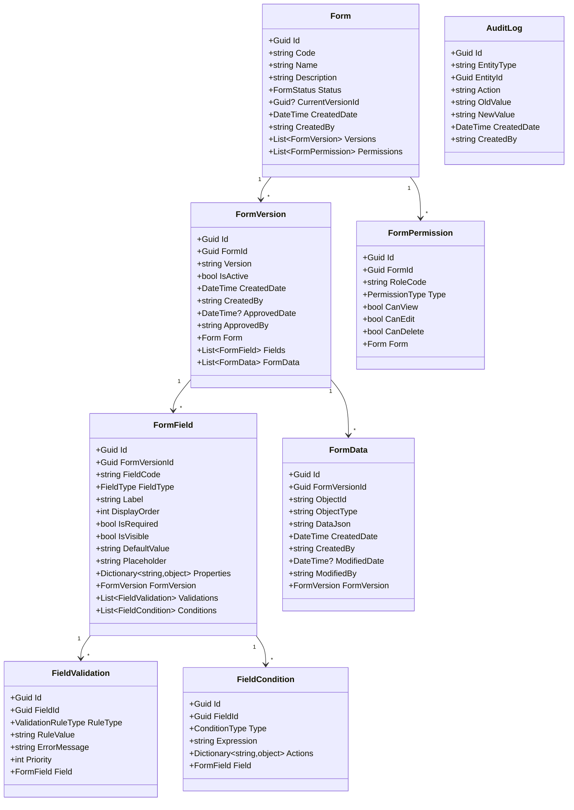
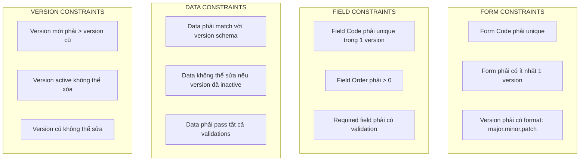
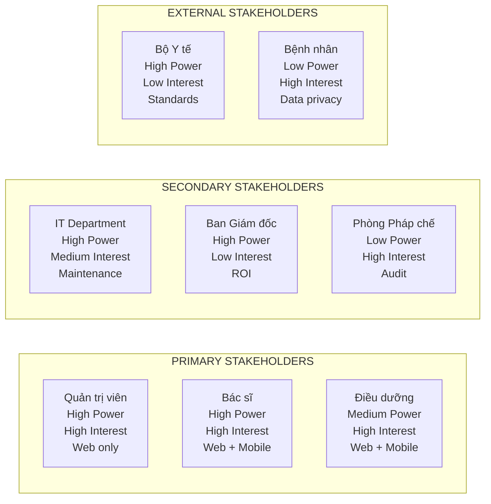

# KIẾN TRÚC NGHIỆP VỤ (BUSINESS ARCHITECTURE) - DYNAMIC FORM SYSTEM

> **Mục tiêu tài liệu**: Mô tả kiến trúc nghiệp vụ, các actor, quy trình, quy tắc nghiệp vụ, và giá trị kinh doanh của hệ thống DynamicForm trong bối cảnh HIS (Hospital Information System).
>
> **Đối tượng đọc**: Business Analyst, Product Owner, Project Manager, Stakeholders, Hội đồng đánh giá.
>
> **Phạm vi**: Bao gồm toàn bộ hệ thống DynamicForm:
> - `DynamicForm.API` (Backend API)
> - `DynamicForm.Web` (Web Application)
> - `DynamicForm.Mobile` (Mobile App - Android, iOS, Windows)

---

## I. TỔNG QUAN NGHIỆP VỤ

### 1.1 Bài toán nghiệp vụ cốt lõi

Trong môi trường HIS (Hospital Information System), các biểu mẫu y tế là thành phần không thể thiếu và thay đổi liên tục:

**Các loại biểu mẫu phổ biến:**
- **Phiếu khám bệnh**: Thông tin bệnh nhân, triệu chứng, chẩn đoán
- **Phiếu chỉ định**: Yêu cầu xét nghiệm, chụp X-quang, siêu âm
- **Phiếu điều dưỡng**: Theo dõi chăm sóc, thuốc, sinh hiệu
- **Bệnh án**: Hồ sơ điều trị đầy đủ, lịch sử bệnh
- **Phiếu xét nghiệm**: Kết quả xét nghiệm, chỉ số sinh hóa
- **Phiếu phẫu thuật**: Thông tin ca mổ, gây mê

**Thách thức nghiệp vụ:**
- Mỗi khoa/phòng có yêu cầu form khác nhau
- Quy định từ Bộ Y tế thay đổi định kỳ (ví dụ: chuyển từ ICD-10 sang ICD-11)
- Cần tuân thủ các tiêu chuẩn y tế quốc tế
- Dữ liệu y tế phải được lưu trữ lâu dài và không thể sửa đổi sau khi lưu

**Giải pháp DynamicForm:**
- Tách biệt **metadata** (cấu trúc form) và **data** (dữ liệu nhập liệu)
- Quản lý **version** để đảm bảo tính toàn vẹn dữ liệu lịch sử
- **Render động** form từ metadata, không cần code mới
- Hỗ trợ **multi-channel**: Web, Mobile (Android/iOS), Desktop

### 1.2 Sơ đồ Business Architecture tổng thể



## II. LUỒNG NGHIỆP VỤ CHÍNH

### 2.1 Luồng Tạo và Quản lý Form



### 2.2 Luồng Điền Form (Bác sĩ/Điều dưỡng) - Multi-Channel

#### 2.2.1 Luồng qua Web Application



#### 2.2.2 Luồng qua Mobile App (Android/iOS)



### 2.3 Luồng Tạo Version Mới



### 2.4 Luồng Xem Dữ liệu Form Cũ



## III. BUSINESS DOMAIN MODEL

### 3.1 Domain Entities và Relationships



## IV. BUSINESS RULES VÀ CONSTRAINTS

### 4.1 Business Rules

| Rule ID | Mô tả | Áp dụng cho |
|---------|-------|-------------|
| BR-001 | Form version phải immutable (không sửa được sau khi tạo) | FormVersion |
| BR-002 | Chỉ có 1 version active tại một thời điểm | Form |
| BR-003 | Form data phải gắn với version cụ thể | FormData |
| BR-004 | Validation phải chạy cả client và server | FormField |
| BR-005 | Mọi thay đổi form phải được audit | Form, FormVersion |
| BR-006 | User chỉ có thể edit form data nếu có quyền | FormPermission |
| BR-007 | Form data cũ không thể sửa sau khi version mới active | FormData |
| BR-008 | Field có điều kiện chỉ hiển thị khi condition đúng | FormField |

### 4.2 Business Constraints



## V. BUSINESS SCENARIOS

### 5.1 Scenario: Bộ Y tế ban hành mẫu bệnh án mới

```
1. Admin nhận thông báo về mẫu bệnh án mới từ Bộ Y tế
2. Admin tạo version mới cho form BENH_AN (v2.0)
3. Admin cập nhật các field theo mẫu mới:
   - Thêm field mới: "Mã ICD-11"
   - Sửa field: "Chẩn đoán" thành "Chẩn đoán chính" và "Chẩn đoán phụ"
   - Xóa field cũ: "Mã ICD-10"
4. Admin thiết lập validation mới cho field "Mã ICD-11"
5. Admin duyệt và kích hoạt version mới
6. Từ thời điểm này, bệnh án mới sẽ dùng version 2.0
7. Bệnh án cũ (version 1.0) vẫn giữ nguyên, không thể sửa
```

### 5.2 Scenario: Bác sĩ điền phiếu khám với validation động (Web)

```
1. Bác sĩ mở trình duyệt, truy cập DynamicForm.Web
2. Chọn form PHIEU_KHAM cho bệnh nhân
3. Form load metadata từ version active qua API
4. Bác sĩ nhập thông tin:
   - Họ tên: "Nguyễn Văn A"
   - Tuổi: 25
   - Huyết áp: 180/120
5. Khi nhập Huyết áp, validation trigger:
   - Range check: 180 > 140 (cao) → Warning
   - Conditional: Nếu Huyết áp > 140 → Hiển thị field "Ghi chú"
6. Bác sĩ điền thêm "Ghi chú": "Cần theo dõi"
7. Submit form:
   - Client validation: Pass
   - Server validation: Pass
   - Lưu vào database với FormVersionId = v1.0
8. Thành công, hiển thị thông báo
```

### 5.2b Scenario: Điều dưỡng điền phiếu chăm sóc trên Mobile (Android/iOS)

```
1. Điều dưỡng mở app DynamicForm.Mobile trên điện thoại
2. App hiển thị danh sách form, chọn PHIEU_CHAM_SOC
3. App gọi API: GET /api/forms/code/PHIEU_CHAM_SOC/metadata
4. App render form động từ metadata (Entry, DatePicker, Picker...)
5. Điều dưỡng nhập dữ liệu:
   - Thời gian: 14:30
   - Nhiệt độ: 37.5°C
   - Huyết áp: 120/80
   - Mạch: 75
6. Submit form:
   - App gọi POST /api/formdata/validate (validate trước)
   - Nếu có lỗi: hiển thị lỗi dưới từng field
   - Nếu OK: gọi POST /api/formdata để lưu
7. Thành công, app hiển thị thông báo
8. Dữ liệu được lưu với FormVersionId = version active
```

### 5.3 Scenario: Xem bệnh án cũ với version khác

```
1. Bác sĩ mở bệnh án từ năm 2023 (ObjectId: 12345)
2. System load FormData:
   - FormVersionId = v1.0 (version cũ)
   - DataJson = {...}
3. System load FormVersion metadata của v1.0
4. System load Fields của v1.0
5. Form được render theo đúng schema của v1.0:
   - Hiển thị field "Mã ICD-10" (có trong v1.0)
   - Không hiển thị field "Mã ICD-11" (chỉ có trong v2.0)
6. Dữ liệu hiển thị đúng với version khi tạo
```

## VI. BUSINESS CAPABILITIES

### 6.1 Core Capabilities

| Capability | Mô tả | Business Value | Implementation |
|------------|-------|----------------|----------------|
| Form Design | Tạo và cấu hình form metadata | Giảm thời gian phát triển form từ tuần → giờ | Web Designer UI |
| Dynamic Rendering | Render form từ metadata | Không cần code mới cho mỗi form | Web (Razor) + Mobile (MAUI) |
| Version Management | Quản lý version form | Đảm bảo tính toàn vẹn dữ liệu lịch sử | API + Database |
| Dynamic Validation | Validation động theo rules | Linh hoạt, dễ thay đổi | Client + Server |
| Data Persistence | Lưu trữ dữ liệu form | Tách biệt metadata và data | SQL Server |
| Multi-Channel Access | Truy cập qua Web và Mobile | Linh hoạt, phù hợp mọi tình huống | Web + Mobile App |
| Audit Trail | Theo dõi mọi thay đổi | Compliance, pháp lý | Database + Logging |

### 6.2 Supporting Capabilities

| Capability | Mô tả | Status |
|------------|-------|--------|
| Permission Management | Phân quyền theo role, form, field | Planned |
| Export/Import | Xuất/nhập form metadata | Planned |
| Template Management | Quản lý form templates | Planned |
| Reporting | Báo cáo sử dụng form | Planned |
| Integration | Tích hợp với HIS, LIS, PACS | Planned |
| Offline Support | Mobile app hoạt động offline | Future |
| Push Notifications | Thông báo khi có form mới | Future |
| Biometric Auth | Xác thực bằng vân tay/face ID | Future |

## VII. BUSINESS VALUE PROPOSITION

### 7.1 Giá trị cho Tổ chức

- ✅ **Giảm chi phí phát triển**: Không cần code mới cho mỗi form
- ✅ **Tăng tốc độ thay đổi**: Cập nhật form trong vài phút thay vì vài tuần
- ✅ **Đảm bảo compliance**: Versioning đảm bảo dữ liệu lịch sử
- ✅ **Chuẩn hóa**: Tất cả form dùng chung framework

### 7.2 Giá trị cho Người dùng

- ✅ **Dễ sử dụng**: UI nhất quán, validation rõ ràng
- ✅ **Linh hoạt**: Form thích ứng với nghiệp vụ
- ✅ **Đáng tin cậy**: Dữ liệu được validate chặt chẽ
- ✅ **Truy vết**: Có thể xem lại mọi thay đổi
- ✅ **Multi-channel**: Sử dụng được trên Web và Mobile
- ✅ **Mobile-first**: Điền form ngay tại giường bệnh, không cần máy tính

### 7.3 Giá trị cho Tổ chức (ROI)

| Metric | Trước DynamicForm | Sau DynamicForm | Cải thiện |
|--------|-------------------|-----------------|-----------|
| Thời gian tạo form mới | 2-4 tuần | 2-4 giờ | **90% giảm** |
| Chi phí phát triển form | $5,000-10,000 | $500-1,000 | **80% giảm** |
| Thời gian cập nhật form | 1-2 tuần | 30 phút - 2 giờ | **95% giảm** |
| Tỷ lệ lỗi dữ liệu | 5-10% | <1% | **90% giảm** |
| Compliance audit | Khó khăn | Tự động | **100% cải thiện** |

## VIII. STAKEHOLDER MAP



## IX. BUSINESS PROCESS MATRIX

### 9.1 Mapping Actors với Processes và Channels

| Actor | Process | Primary Channel | Secondary Channel |
|-------|---------|-----------------|-------------------|
| Admin | Form Design | Web | - |
| Admin | Version Management | Web | - |
| Doctor | Form Filling | Mobile | Web |
| Doctor | Form Review | Web | Mobile |
| Nurse | Form Filling | Mobile | Web |
| Nurse | Form Review | Mobile | Web |
| Lab Tech | Form Filling | Mobile | Web |
| Admin Staff | Reporting | Web | - |

### 9.2 Channel Selection Criteria

| Criteria | Web | Mobile |
|----------|-----|--------|
| **Use Case** | Design, Admin, Reporting | Field work, Quick entry |
| **Device** | Desktop, Tablet | Smartphone, Tablet |
| **Network** | Always connected | Can work offline (future) |
| **Complexity** | High (full features) | Medium (core features) |
| **Performance** | Fast | Fast (native) |
| **User Experience** | Rich UI | Native, touch-optimized |

## X. BUSINESS METRICS & KPIs

### 10.1 Operational Metrics

| Metric | Target | Measurement |
|--------|--------|-------------|
| Form creation time | < 4 hours | Time from request to active |
| Form update time | < 2 hours | Time to update and activate |
| Data entry accuracy | > 99% | Validation error rate |
| System uptime | > 99.9% | Availability monitoring |
| Mobile app usage | > 60% of entries | Analytics tracking |

### 10.2 Business Impact Metrics

| Metric | Baseline | Target (6 months) |
|--------|----------|-------------------|
| Forms created | 10 forms/month | 50 forms/month |
| Data entries | 1,000/day | 5,000/day |
| User satisfaction | 70% | 90% |
| Time saved per form | - | 2-4 weeks |
| Cost per form | $5,000 | $500 |

---

## XI. PHỤ LỤC: BUSINESS GLOSSARY

| Thuật ngữ | Định nghĩa |
|-----------|------------|
| **Form** | Một biểu mẫu nghiệp vụ (ví dụ: Phiếu khám, Bệnh án) |
| **Metadata** | Dữ liệu mô tả cấu trúc form (fields, validation, layout) |
| **FormData** | Dữ liệu thực tế do người dùng nhập vào form |
| **Version** | Phiên bản của form, immutable sau khi tạo |
| **Active Version** | Version đang được sử dụng để tạo form data mới |
| **Field** | Một trường dữ liệu trong form (text, number, date, select...) |
| **Validation Rule** | Quy tắc kiểm tra dữ liệu nhập vào |
| **Conditional Logic** | Logic hiển thị field dựa trên giá trị field khác |
| **ObjectId** | ID của đối tượng nghiệp vụ gắn với form data (ví dụ: PatientId) |
| **ObjectType** | Loại đối tượng (ví dụ: PHIEU_KHAM, BENH_AN) |
| **Audit Trail** | Lịch sử thay đổi của form và data |
| **Multi-Channel** | Hỗ trợ nhiều kênh truy cập (Web, Mobile) |
| **Offline Mode** | Khả năng hoạt động không cần kết nối mạng (future) |

---

**Tài liệu này được cập nhật lần cuối**: Khi có thay đổi về business requirements hoặc thêm channel mới.
