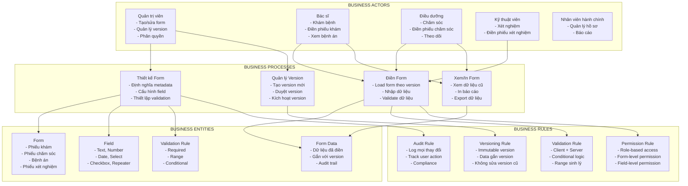
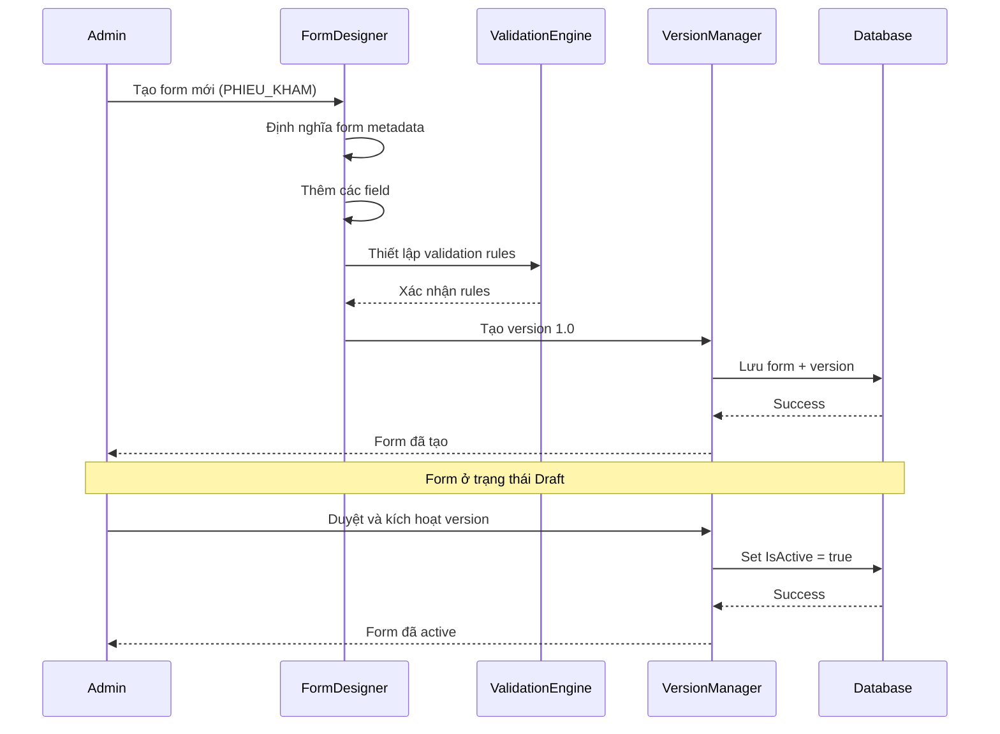
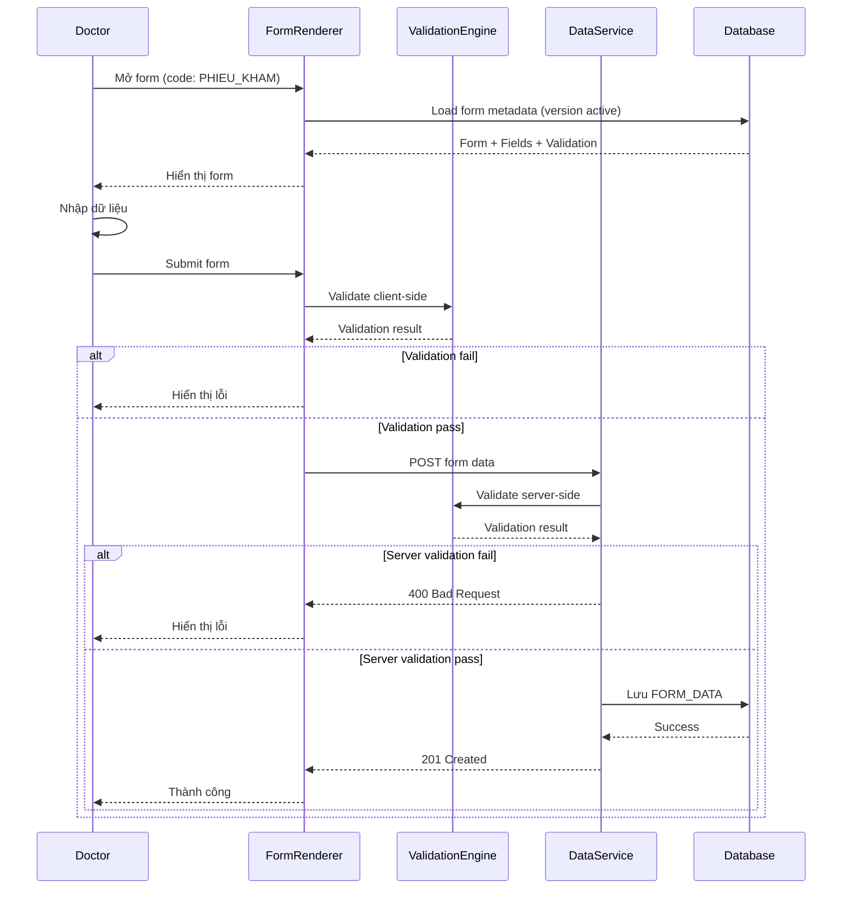
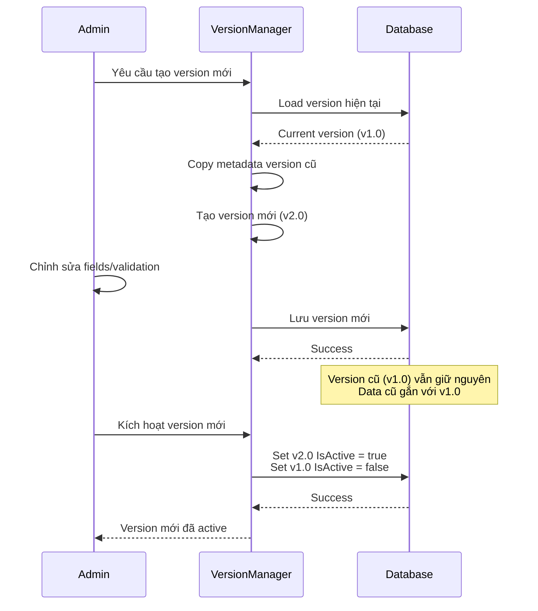
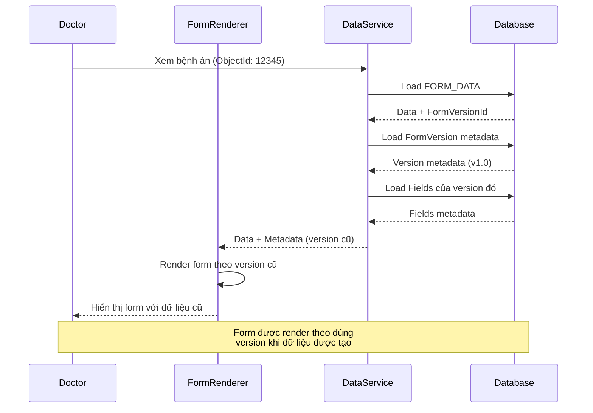
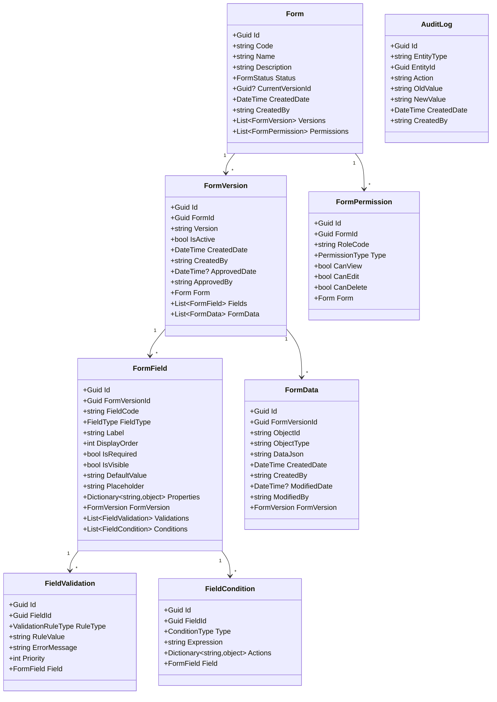
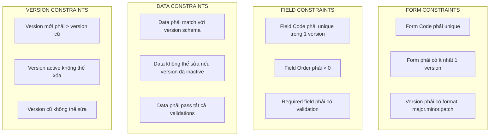
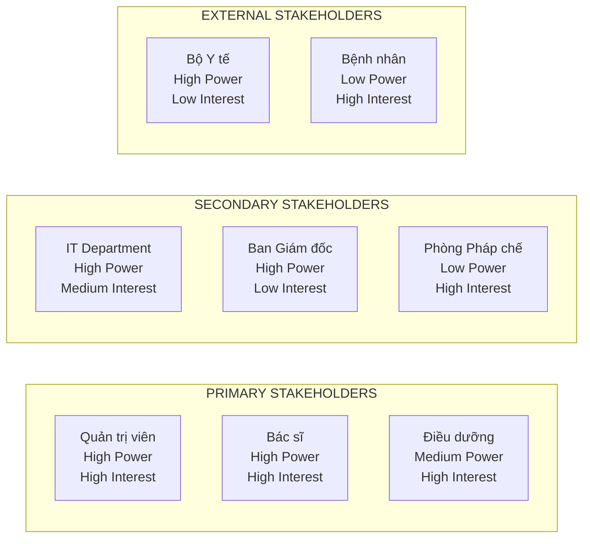

# SƠ ĐỒ KIẾN TRÚC NGHIỆP VỤ (BUSINESS ARCHITECTURE) - DYNAMIC FORM SYSTEM

## I. TỔNG QUAN NGHIỆP VỤ

### 1.1 Sơ đồ Business Architecture tổng thể



## II. LUỒNG NGHIỆP VỤ CHÍNH

### 2.1 Luồng Tạo và Quản lý Form



### 2.2 Luồng Điền Form (Bác sĩ/Điều dưỡng)



### 2.3 Luồng Tạo Version Mới



### 2.4 Luồng Xem Dữ liệu Form Cũ



## III. BUSINESS DOMAIN MODEL

### 3.1 Domain Entities và Relationships



## IV. BUSINESS RULES VÀ CONSTRAINTS

### 4.1 Business Rules

| Rule ID | Mô tả | Áp dụng cho |
|---------|-------|-------------|
| BR-001 | Form version phải immutable (không sửa được sau khi tạo) | FormVersion |
| BR-002 | Chỉ có 1 version active tại một thời điểm | Form |
| BR-003 | Form data phải gắn với version cụ thể | FormData |
| BR-004 | Validation phải chạy cả client và server | FormField |
| BR-005 | Mọi thay đổi form phải được audit | Form, FormVersion |
| BR-006 | User chỉ có thể edit form data nếu có quyền | FormPermission |
| BR-007 | Form data cũ không thể sửa sau khi version mới active | FormData |
| BR-008 | Field có điều kiện chỉ hiển thị khi condition đúng | FormField |

### 4.2 Business Constraints



## V. BUSINESS SCENARIOS

### 5.1 Scenario: Bộ Y tế ban hành mẫu bệnh án mới

```
1. Admin nhận thông báo về mẫu bệnh án mới từ Bộ Y tế
2. Admin tạo version mới cho form BENH_AN (v2.0)
3. Admin cập nhật các field theo mẫu mới:
   - Thêm field mới: "Mã ICD-11"
   - Sửa field: "Chẩn đoán" thành "Chẩn đoán chính" và "Chẩn đoán phụ"
   - Xóa field cũ: "Mã ICD-10"
4. Admin thiết lập validation mới cho field "Mã ICD-11"
5. Admin duyệt và kích hoạt version mới
6. Từ thời điểm này, bệnh án mới sẽ dùng version 2.0
7. Bệnh án cũ (version 1.0) vẫn giữ nguyên, không thể sửa
```

### 5.2 Scenario: Bác sĩ điền phiếu khám với validation động

```
1. Bác sĩ mở form PHIEU_KHAM cho bệnh nhân
2. Form load metadata từ version active
3. Bác sĩ nhập thông tin:
   - Họ tên: "Nguyễn Văn A"
   - Tuổi: 25
   - Huyết áp: 180/120
4. Khi nhập Huyết áp, validation trigger:
   - Range check: 180 > 140 (cao) → Warning
   - Conditional: Nếu Huyết áp > 140 → Hiển thị field "Ghi chú"
5. Bác sĩ điền thêm "Ghi chú": "Cần theo dõi"
6. Submit form:
   - Client validation: Pass
   - Server validation: Pass
   - Lưu vào database với FormVersionId = v1.0
7. Thành công
```

### 5.3 Scenario: Xem bệnh án cũ với version khác

```
1. Bác sĩ mở bệnh án từ năm 2023 (ObjectId: 12345)
2. System load FormData:
   - FormVersionId = v1.0 (version cũ)
   - DataJson = {...}
3. System load FormVersion metadata của v1.0
4. System load Fields của v1.0
5. Form được render theo đúng schema của v1.0:
   - Hiển thị field "Mã ICD-10" (có trong v1.0)
   - Không hiển thị field "Mã ICD-11" (chỉ có trong v2.0)
6. Dữ liệu hiển thị đúng với version khi tạo
```

## VI. BUSINESS CAPABILITIES

### 6.1 Core Capabilities

| Capability | Mô tả | Business Value |
|------------|-------|----------------|
| Form Design | Tạo và cấu hình form metadata | Giảm thời gian phát triển form từ tuần → giờ |
| Dynamic Rendering | Render form từ metadata | Không cần code mới cho mỗi form |
| Version Management | Quản lý version form | Đảm bảo tính toàn vẹn dữ liệu lịch sử |
| Dynamic Validation | Validation động theo rules | Linh hoạt, dễ thay đổi |
| Data Persistence | Lưu trữ dữ liệu form | Tách biệt metadata và data |
| Audit Trail | Theo dõi mọi thay đổi | Compliance, pháp lý |

### 6.2 Supporting Capabilities

| Capability | Mô tả |
|------------|-------|
| Permission Management | Phân quyền theo role, form, field |
| Export/Import | Xuất/nhập form metadata |
| Template Management | Quản lý form templates |
| Reporting | Báo cáo sử dụng form |
| Integration | Tích hợp với HIS, LIS, PACS |

## VII. BUSINESS VALUE PROPOSITION

### 7.1 Giá trị cho Tổ chức

- ✅ **Giảm chi phí phát triển**: Không cần code mới cho mỗi form
- ✅ **Tăng tốc độ thay đổi**: Cập nhật form trong vài phút thay vì vài tuần
- ✅ **Đảm bảo compliance**: Versioning đảm bảo dữ liệu lịch sử
- ✅ **Chuẩn hóa**: Tất cả form dùng chung framework

### 7.2 Giá trị cho Người dùng

- ✅ **Dễ sử dụng**: UI nhất quán, validation rõ ràng
- ✅ **Linh hoạt**: Form thích ứng với nghiệp vụ
- ✅ **Đáng tin cậy**: Dữ liệu được validate chặt chẽ
- ✅ **Truy vết**: Có thể xem lại mọi thay đổi

## VIII. STAKEHOLDER MAP


