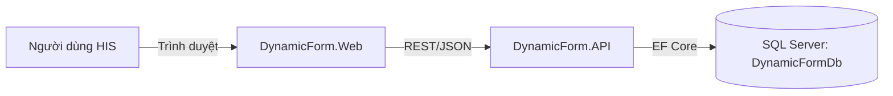
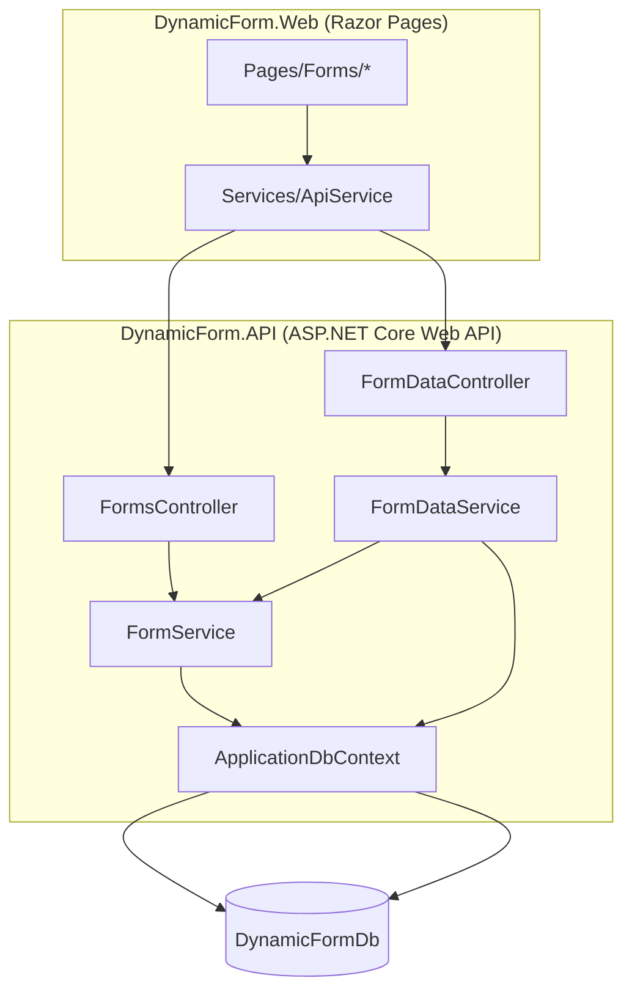
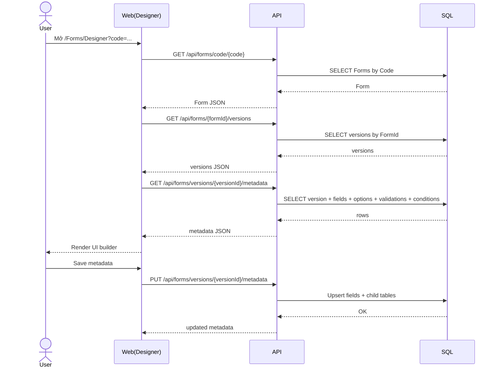
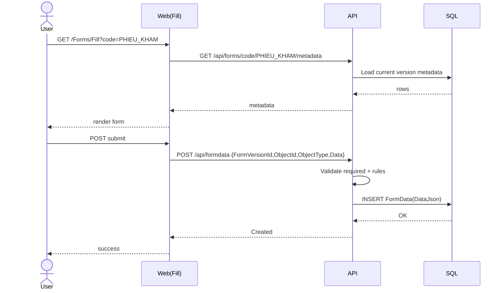
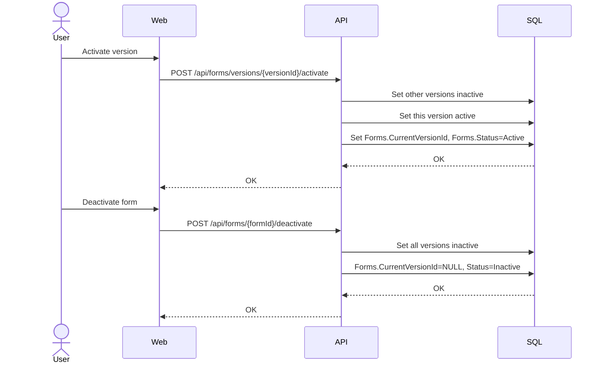
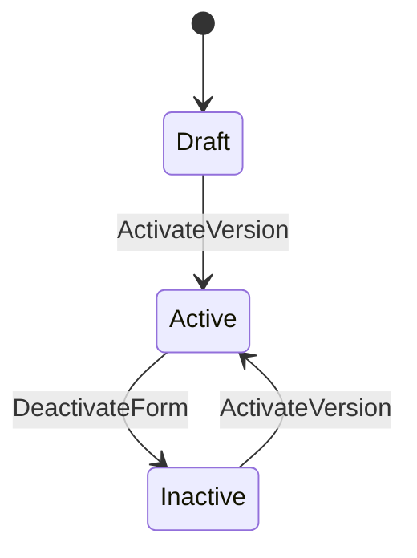
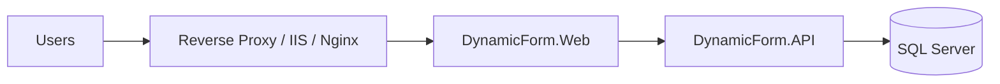

# TÀI LIỆU THIẾT KẾ KỸ THUẬT (TDD) – DYNAMIC FORM (HIS)

> **Mục tiêu của tài liệu**: mô tả kiến trúc, mô hình dữ liệu, API contract, luồng xử lý, tiêu chuẩn kỹ thuật và định hướng mở rộng cho dự án **DynamicForm** (Backend API + Web UI) trong bối cảnh HIS.
>
> **Đối tượng đọc**: Dev Backend/Frontend, DevOps, Tester, Reviewer hội đồng.
>
> **Phạm vi**: bám sát codebase hiện tại:
> - `DynamicForm.API` (ASP.NET Core Web API + EF Core + SQL Server)
> - `DynamicForm.Web` (ASP.NET Core Razor Pages + Bootstrap, gọi API qua `ApiService`)
> - Database `DynamicFormDb`

---

## 0. Mục lục

1. [Tổng quan](#1-tổng-quan)  
2. [Yêu cầu phi chức năng (NFR)](#2-yêu-cầu-phi-chức-năng-nfr)  
3. [Kiến trúc tổng thể (C4)](#3-kiến-trúc-tổng-thể-c4)  
4. [Mô hình dữ liệu & ERD](#4-mô-hình-dữ-liệu--erd)  
5. [Luồng nghiệp vụ chính (Sequence)](#5-luồng-nghiệp-vụ-chính-sequence)  
6. [Thiết kế API (Contract)](#6-thiết-kế-api-contract)  
7. [Thiết kế UI (Web)](#7-thiết-kế-ui-web)  
8. [Trạng thái Form/Version (State machine)](#8-trạng-thái-formversion-state-machine)  
9. [Chiến lược dữ liệu lớn & truy vấn nhanh (100M+)](#9-chiến-lược-dữ-liệu-lớn--truy-vấn-nhanh-100m)  
10. [Bảo mật & tuân thủ HIS](#10-bảo-mật--tuân-thủ-his)  
11. [Logging/Monitoring/Observability](#11-loggingmonitoringobservability)  
12. [Triển khai (Deployment)](#12-triển-khai-deployment)  
13. [Test strategy](#13-test-strategy)  
14. [Rủi ro & hướng phát triển](#14-rủi-ro--hướng-phát-triển)  
15. [Phụ lục: Quy ước, enum, rule](#15-phụ-lục-quy-ước-enum-rule)  

---

## 1. Tổng quan

### 1.1. Bài toán
HIS thường có rất nhiều **biểu mẫu** (phiếu khám, phiếu chỉ định, phiếu điều dưỡng…). Các biểu mẫu thay đổi theo:
- Nghiệp vụ từng khoa/phòng
- Quy định/bộ tiêu chí
- Thay đổi theo thời gian (versioning)

Mục tiêu của **DynamicForm** là:
- Lưu **metadata** của form (cấu trúc field, validation, option, điều kiện hiển thị)
- Render UI nhập liệu từ metadata
- Lưu dữ liệu nhập liệu (FormData) theo version
- Quản lý version: tạo version mới, kích hoạt version đang dùng

### 1.2. Thành phần trong codebase hiện tại
- `DynamicForm.API`:
  - `FormsController`: CRUD form/version + metadata + activate/deactivate
  - `FormDataController`: tạo/cập nhật dữ liệu form, validate
  - `FormService`: lấy metadata, update metadata, activate/deactivate
  - `FormDataService`: validate và lưu FormData
- `DynamicForm.Web`:
  - `/Forms` (Danh sách form) + tạo form/version (smart create)
  - `/Forms/Designer` (thiết kế metadata) + lưu metadata + activate version
  - `/Forms/Fill` (điền form) + submit (POST) và hiển thị lỗi debug

---

## 2. Yêu cầu phi chức năng (NFR)

### 2.1. Performance
- **Load metadata**: < 1s (cache/tối ưu query)
- **Render form**: < 1s (tuỳ độ phức tạp UI)
- **Submit**: < 1s cho dữ liệu vừa (khoảng vài chục field)
- Mục tiêu dài hạn: hỗ trợ **100M+ bản ghi** formdata (chi tiết ở mục 9)

### 2.2. Reliability
- Uptime >= 99.9% (nếu triển khai production)
- Backup định kỳ DB
- Có chiến lược DR/Restore

### 2.3. Security & Compliance
- TLS (HTTPS) mọi môi trường production
- RBAC theo role (doctor/nurse/admin)
- Audit trail (đặc biệt khi sửa dữ liệu)
- Data encryption at rest (DB TDE hoặc disk encryption) và in transit

---

## 3. Kiến trúc tổng thể (C4)

### 3.1. C4 – Context


### 3.2. C4 – Container


### 3.3. Ghi chú kiến trúc
- Hiện tại Web là Razor Pages (server-render) nhưng **logic dữ liệu/metadata** tách riêng ở API → thuận lợi để chuyển sang SPA sau này.
- CORS đã bật ở API (dev) để hỗ trợ client tách biệt.

---

## 4. Mô hình dữ liệu & ERD

> Tham khảo thêm ERD chi tiết trong `docs/docs/03-DATABASE-ERD.md`.

### 4.1. ERD rút gọn theo codebase
```mermaid
erDiagram
  Forms ||--o{ FormVersions : has
  FormVersions ||--o{ FormFields : has
  FormFields ||--o{ FieldOptions : has
  FormFields ||--o{ FieldValidations : has
  FormFields ||--o{ FieldConditions : has
  FormVersions ||--o{ FormData : stores
  FormData ||--o{ FormDataHistory : history

  Forms {
    uniqueidentifier Id PK
    nvarchar Code UK
    nvarchar Name
    nvarchar Description
    int Status
    uniqueidentifier CurrentVersionId FK
    datetime2 CreatedDate
    nvarchar CreatedBy
  }

  FormVersions {
    uniqueidentifier Id PK
    uniqueidentifier FormId FK
    nvarchar Version UK(FormId,Version)
    bit IsActive
    datetime2 CreatedDate
    nvarchar CreatedBy
    datetime2 ApprovedDate
    nvarchar ApprovedBy
    nvarchar ChangeLog
  }

  FormFields {
    uniqueidentifier Id PK
    uniqueidentifier FormVersionId FK
    nvarchar FieldCode UK(FormVersionId,FieldCode)
    int FieldType
    nvarchar Label
    int DisplayOrder
    bit IsRequired
    bit IsVisible
    nvarchar DefaultValue
    nvarchar Placeholder
    nvarchar HelpText
    nvarchar CssClass
    nvarchar PropertiesJson
  }

  FormData {
    uniqueidentifier Id PK
    uniqueidentifier FormVersionId FK
    nvarchar ObjectId
    nvarchar ObjectType
    nvarchar DataJson
    datetime2 CreatedDate
    int Status
  }
```

### 4.2. Phân tách dữ liệu
- **Metadata**:
  - `Forms`, `FormVersions`, `FormFields`, `FieldOptions`, `FieldValidations`, `FieldConditions`
- **Data entry**:
  - `FormData` (hiện tại lưu JSON tại `DataJson`)
  - `FormDataHistory` (lưu lịch sử khi update)

---

## 5. Luồng nghiệp vụ chính (Sequence)

### 5.1. Thiết kế metadata (Designer)


### 5.2. Điền form & submit


### 5.3. Activate/Deactivate


---

## 6. Thiết kế API (Contract)

> Nguồn tham chiếu: `DynamicForm.API/Controllers/*` và Swagger.

### 6.1. Forms
- `GET /api/forms`
- `GET /api/forms/code/{code}`
- `POST /api/forms`
  - Request: `FormDto`
  - Response: `FormDto`
  - Lỗi thân thiện:
    - `"Form code already exists: {code}"`
- `GET /api/forms/{formId}/versions`
- `POST /api/forms/{formId}/versions`
  - Lỗi thân thiện:
    - `"Version already exists: {version}"`
- `GET /api/forms/code/{code}/metadata`
- `GET /api/forms/versions/{versionId}/metadata`
- `PUT /api/forms/versions/{versionId}/metadata`
- `POST /api/forms/versions/{versionId}/activate`
- `POST /api/forms/{formId}/deactivate`

### 6.2. FormData
- `POST /api/formdata`
  - `CreateFormDataRequest { FormVersionId, ObjectId, ObjectType, Data }`
  - Lỗi validate trả 400 với message “Validation failed …”
- `GET /api/formdata/{id}`
- `GET /api/formdata/object/{objectId}/{objectType}`
- `PUT /api/formdata/{id}`
- `POST /api/formdata/validate`

---

## 7. Thiết kế UI (Web)

### 7.1. Pages
- `/Forms`:
  - list form
  - tạo form/version theo rule “smart create”
  - deactivate form
- `/Forms/Designer`:
  - chọn form/version (auto-load)
  - CRUD field (toolbox + preview + properties)
  - drag-drop reorder
  - validate trùng fieldCode trước khi lưu
  - activate version
- `/Forms/Fill`:
  - render theo metadata
  - submit FormData
  - log lỗi ra console khi fail

### 7.2. UX rule “smart create”
- Nếu `Code` đã tồn tại → coi thao tác là **tạo version mới**.
- Nếu `Code` chưa tồn tại → bắt buộc nhập `Name` để tạo form mới.

---

## 8. Trạng thái Form/Version (State machine)


Ghi chú:
- `Forms.Status` phản ánh trạng thái tổng quan
- `FormVersions.IsActive` phản ánh version nào đang dùng

---

## 9. Chiến lược dữ liệu lớn & truy vấn nhanh (100M+)

### 9.1. Vấn đề
Lưu toàn bộ dữ liệu dưới dạng `DataJson` thuận tiện cho form động, nhưng khi:
- 100M bản ghi
- cần lọc theo field như `HO_VA_TEN`

thì query sẽ chậm do:
- parse JSON
- khó index theo từng field
- dễ rơi vào scan

### 9.2. Mục tiêu
Vẫn giữ form **động**, nhưng query nhanh theo field quan trọng.

### 9.3. 3 lựa chọn kiến trúc lưu dữ liệu
1) **Hybrid JSON + Materialized Columns** (phù hợp khi chỉ vài field cần query)  
2) **EAV/Index table (FormDataValue)** (phù hợp khi nhiều field cần query/report)  
3) **Bảng riêng theo form/version** (nhanh nhất nhưng mất “động”)

### 9.4. Khuyến nghị cho case “cả 3” (dynamic + dữ liệu lớn + query nhiều)
Chọn **EAV/Index table**:
- `FormData` vẫn lưu `DataJson` làm “source of truth”
- thêm bảng `FormDataValue` (mỗi field = 1 dòng) để index/search

Ví dụ schema đề xuất:
- `FormDataValue(FormDataId, ObjectType, FieldCode, ValueString, ValueNumber, ValueDate, ValueStringSearch, CreatedDate)`

Index gợi ý:
- `IX_FormDataValue_ObjectType_FieldCode_ValueStringSearch (ObjectType, FieldCode, ValueStringSearch) INCLUDE(FormDataId, CreatedDate)`

Query mẫu:
- Lọc theo tên bệnh nhân:
  - `WHERE ObjectType='PHIEU_KHAM' AND FieldCode='HO_VA_TEN' AND ValueStringSearch LIKE 'VU XUAN DU%'`

**Ghi chú cực quan trọng**:
- Nếu cần `contains` (`%DU%`) → cân nhắc **Full-Text Search** hoặc search engine riêng.
- Trong HIS thật, nên dùng `ObjectId = PatientId` (không phải GUID random) để join/filter nhanh hơn.

---

## 10. Bảo mật & tuân thủ HIS
- **AuthN/AuthZ**: đề xuất JWT/Cookie + RBAC (RoleCode)
- **Audit**:
  - `FormDataHistory` lưu lịch sử cập nhật
  - bổ sung “who/when/why” cho cập nhật quan trọng
- **PII/PHI**:
  - mã hoá khi lưu trữ (TDE/Always Encrypted tuỳ mức)
  - hạn chế log dữ liệu bệnh nhân

---

## 11. Logging/Monitoring/Observability
- API:
  - structured logs (Serilog hoặc built-in logging)
  - correlation id (trace)
  - health checks
- DB:
  - index usage + slow query log
  - kế hoạch partitioning (nếu 100M+)

---

## 12. Triển khai (Deployment)


Khuyến nghị production:
- tách Web/API thành service riêng
- cấu hình CORS chặt
- secrets qua env/secret manager

---

## 13. Test strategy
- Unit test:
  - validation rules
  - create/activate/deactivate logic
- Integration test:
  - API endpoints (Forms, Metadata, FormData)
- UI smoke:
  - create form/version
  - designer save
  - fill submit

---

## 14. Rủi ro & hướng phát triển
### 14.1. Rủi ro
- JSON storage gây chậm query khi data lớn
- versioning nếu thiếu quy tắc migrate dữ liệu
- thiếu auth/audit cho HIS

### 14.2. Roadmap đề xuất
- Phase 1: hoàn thiện form builder UI/UX + validate + activate
- Phase 2: RBAC + audit + export/import
- Phase 3: EAV/Index table + full-text + partitioning cho 100M+

---

## 15. Phụ lục: Quy ước, enum, rule

### 15.1. Quy ước FieldCode
- `A-Z`, `0-9`, `_`
- không dấu, không space
- ví dụ: `HO_VA_TEN`, `NGAY_SINH`

### 15.2. FieldType (hiện UI đang dùng)
- `1`: Text
- `2`: Number
- `3`: Date
- `6`: Select
- `10`: TextArea

### 15.3. Validation RuleType (trong API hiện xử lý)
- `1`: Required
- `2`: Min
- `3`: Max
- `4`: Range
- `5`: Regex

