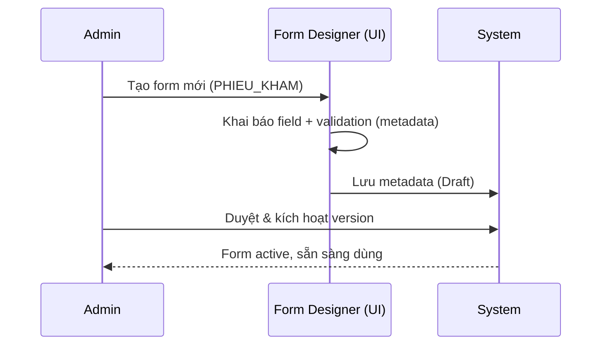
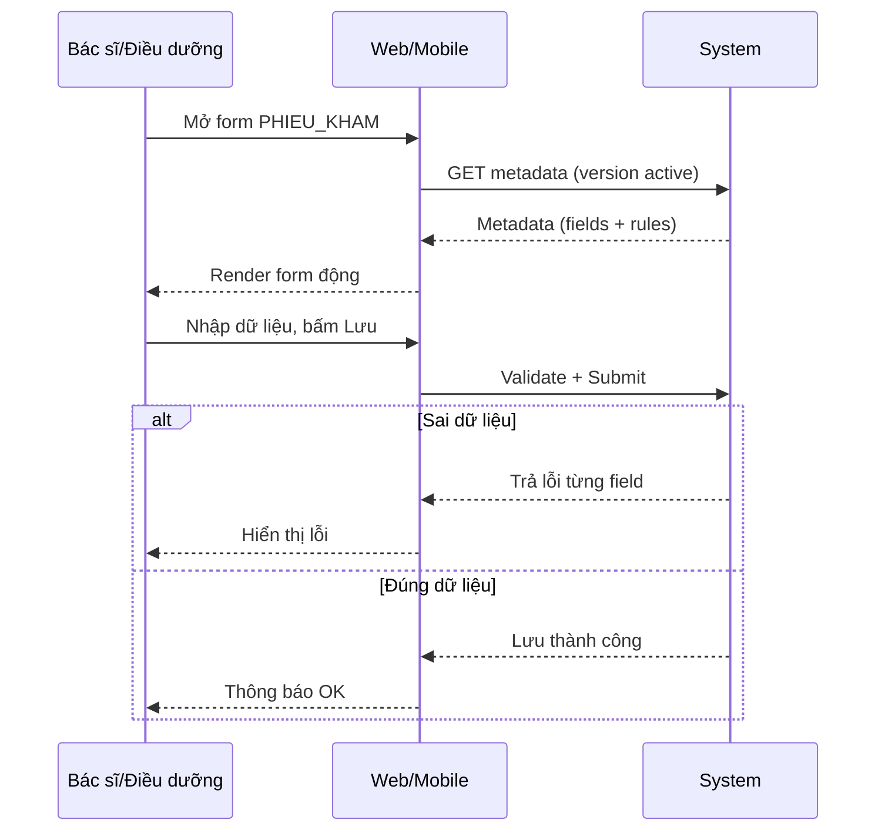
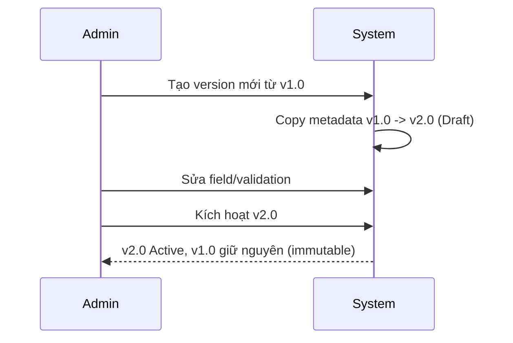
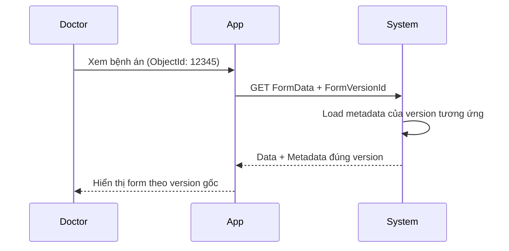
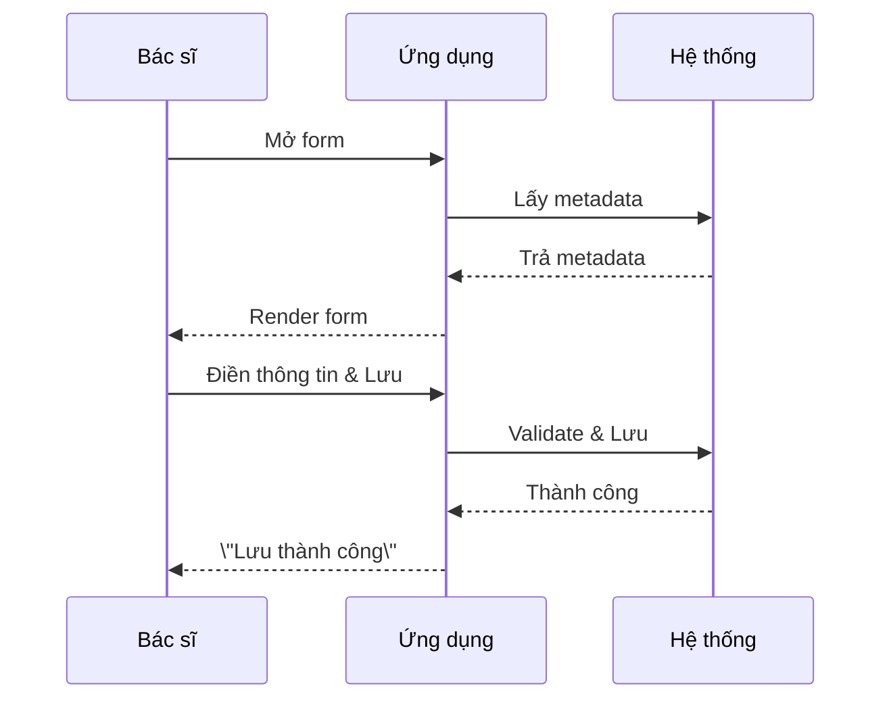
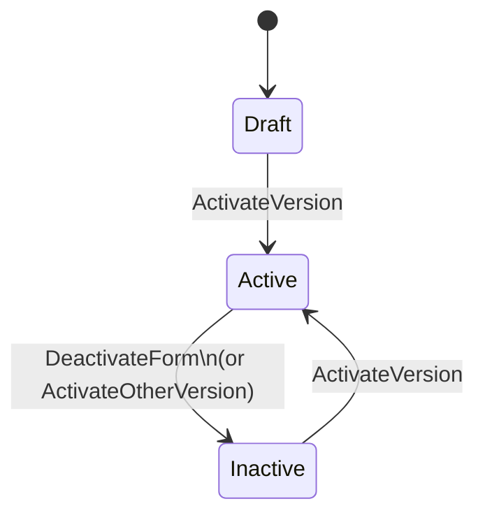

# DYNAMIC FORM MODULE – HLA STYLE DOCUMENT

> **Mục tiêu**: Tài liệu mô-đun Dynamic Form dùng cho thuyết trình/đánh giá (phong cách HLA-Connector), tập trung nghiệp vụ, luồng chính, và cách tích hợp.
>
> **Đối tượng đọc**: PO/BA, kiến trúc sư, tech lead, đội tích hợp.

---

## 1. Bối cảnh & Phạm vi
- HIS có nhiều phiếu (khám, chăm sóc, xét nghiệm…) thay đổi liên tục.
- Dynamic Form cung cấp **metadata-driven form**: khai báo, render động, validate động, versioning.
- Phạm vi: mô-đun DynamicForm (Web + API + Mobile), không đi sâu DB.

## 2. Actor & Vai trò
- **Admin**: Thiết kế form, tạo/kích hoạt version.
- **Doctor/Nurse**: Điền form (phiếu khám, chăm sóc).
- **Lab Tech**: Điền phiếu xét nghiệm.
- **System**: Lưu trữ/validate theo metadata, quản lý version.

## 3. Luồng nghiệp vụ chính

### 3.1. Thiết kế & kích hoạt form (Admin)

### 3.2. Điền form (Doctor/Nurse)

### 3.3. Tạo version mới (Admin)

### 3.4. Xem dữ liệu cũ theo version

## 4. Nguyên tắc nghiệp vụ cốt lõi
- **Metadata-first**: Form/Field/Validation khai báo, không hard-code.
- **Validation hai tầng**: Client (UX) + Server (an toàn).
- **Versioning immutable**: Version cũ không sửa; Data gắn version cụ thể.
- **Reuse**: Metadata tái sử dụng giữa Web/Mobile.

## 5. Khả năng tích hợp
- **API mở**: GET metadata, POST formdata, POST validate.
- **Kênh truy cập**: Web (Razor) và Mobile (MAUI) cùng dùng một metadata.
- **Bảo mật**: dự kiến RBAC (doctor/nurse/admin), TLS, audit (ai/bao giờ/sửa gì).

## 6. KPI kỳ vọng (business)
- Thời gian tạo form mới: 2–4 giờ (thay vì 2–4 tuần).
- Cập nhật form: 30–120 phút (không deploy).
- Lỗi dữ liệu nhập: < 1% (nhờ validation động).
- Duy trì dữ liệu lịch sử: 100% (nhờ versioning).

## 7. Phụ lục: Block Mermaid sẵn dùng (copy-paste)

**Flow điền form đơn giản (3 bước):**

**State machine Form/Version:**

---

**Tài liệu này giữ phong cách HLA-Connector: ngắn gọn, tập trung nghiệp vụ, kèm sơ đồ dễ nhìn.**

---

## 8. Vai trò & Trách nhiệm (RACI rút gọn)
| Hoạt động | Admin | Doctor/Nurse | Lab Tech | System |
|-----------|-------|--------------|----------|--------|
| Thiết kế form | R/A | C | C | I |
| Duyệt/Kích hoạt version | R/A | I | I | C |
| Điền form | I | R/A | R/A | C |
| Validate & Lưu | I | I | I | R/A |
| Xem dữ liệu cũ | I | R/A | R | C |

R: Responsible, A: Accountable, C: Consulted, I: Informed

## 9. Từ vựng nhanh (Glossary)
- **Metadata**: Cấu trúc form (fields, validation, option, condition).
- **FormVersion**: Phiên bản form, immutable sau khi tạo.
- **FormData**: Dữ liệu người dùng nhập, gắn với FormVersionId.
- **Validation hai tầng**: Client (UX) + Server (an toàn dữ liệu).
- **Active Version**: Version đang được dùng để tạo form mới.
- **Immutable**: Version cũ không được sửa; chỉ copy để tạo version mới.

## 10. Điều kiện tối thiểu (MVP)
- Tạo form + version, kích hoạt version.
|- Render động từ metadata (Web/Mobile).
|- Validation động tối thiểu: Required, Range, Regex.
|- Lưu FormData gắn với FormVersion.
|- Xem lại dữ liệu theo đúng version đã lưu.

## 11. Điểm nhấn thuyết trình
- “Không deploy lại khi đổi form” → metadata-first.
- “Dữ liệu lịch sử không vỡ” → versioning immutable.
- “Ít lỗi nhập liệu” → validation hai tầng.
- “Một metadata, nhiều kênh” → Web + Mobile cùng dùng.
