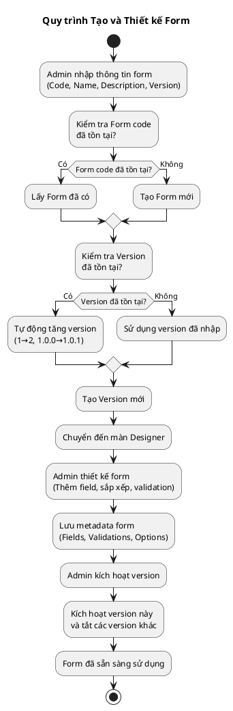
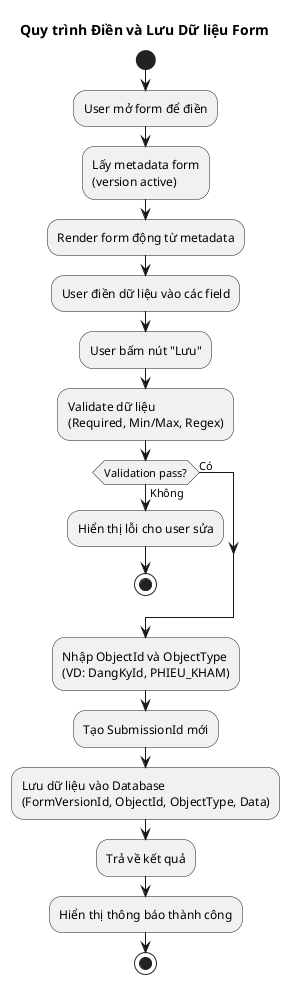
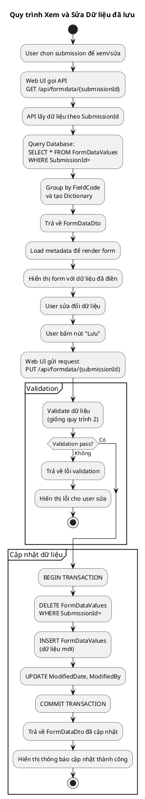
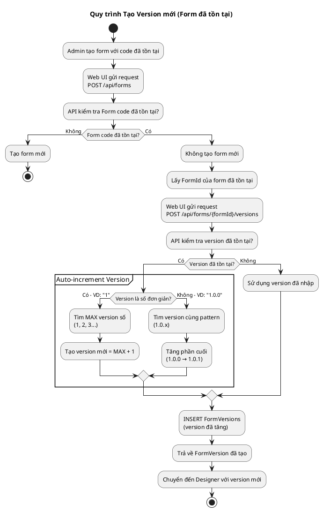
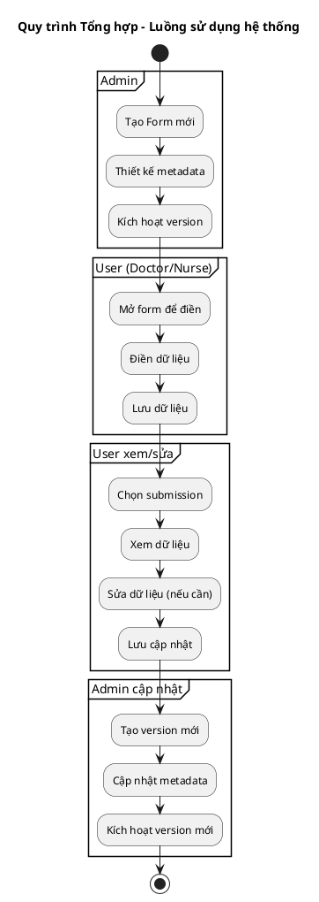

# SƠ ĐỒ UML ACTIVITY DIAGRAM - DYNAMIC FORM

> **Mục tiêu**: Mô tả các quy trình nghiệp vụ chính của hệ thống DynamicForm dưới dạng UML Activity Diagram
>
> **Đối tượng**: Business Analyst, Product Owner, Developer, Tester
>
> **Công cụ**: PlantUML (có thể render tại http://www.plantuml.com/plantuml/uml/)

---

## 1. QUY TRÌNH TẠO VÀ THIẾT KẾ FORM

### 1.1. Mô tả

Quy trình này mô tả cách Admin tạo form mới, thiết kế các field, và kích hoạt version để người dùng có thể sử dụng.

**Luồng chính:**
1. Admin nhập thông tin form (Code, Name, Description, Version)
2. Hệ thống kiểm tra Form code - nếu đã có thì lấy, chưa có thì tạo mới
3. Hệ thống kiểm tra Version - nếu đã tồn tại thì **tự động tăng version** (1→2, 1.0.0→1.0.1)
4. Tạo Version mới và chuyển đến màn Designer
5. Admin thiết kế form (thêm field, sắp xếp, validation)
6. Lưu metadata form
7. Admin kích hoạt version → Form sẵn sàng sử dụng

**Đặc điểm quan trọng:**
- Nếu Form code đã tồn tại: Lấy Form đã có (không tạo mới)
- Nếu Version đã tồn tại: **Tự động tăng version** (1→2, 1.0.0→1.0.1) thay vì báo lỗi
- Hỗ trợ cả version số đơn giản (1, 2, 3...) và semantic version (1.0.0, 1.0.1...)

### 1.2. Activity Diagram



---

## 2. QUY TRÌNH ĐIỀN VÀ LƯU DỮ LIỆU FORM

### 2.1. Mô tả

Quy trình này mô tả cách người dùng (Doctor/Nurse) điền form, hệ thống validate và lưu dữ liệu vào database.

**Luồng chính:**
1. User mở form để điền → Hệ thống lấy metadata của version active
2. Render form động từ metadata
3. User điền dữ liệu vào các field
4. User bấm "Lưu" → Hệ thống validate dữ liệu (Required, Min/Max, Regex)
5. Nếu validation pass → Nhập ObjectId và ObjectType (liên kết với đối tượng nghiệp vụ)
6. Tạo SubmissionId mới và lưu dữ liệu vào Database
7. Hiển thị thông báo thành công

**Thông tin quan trọng:**
- **ObjectId**: ID của đối tượng nghiệp vụ liên quan (VD: DangKyId, BenhNhanId)
- **ObjectType**: Loại đối tượng (VD: PHIEU_KHAM, DANG_KY_KHAM)
- **SubmissionId**: Tự động tăng, dùng để nhóm các FormDataValue của cùng 1 submission
- Validation bao gồm: Required fields, Min/Max values, Regex patterns

### 2.2. Activity Diagram



---

## 3. QUY TRÌNH XEM VÀ SỬA DỮ LIỆU ĐÃ LƯU

### 3.1. Mô tả

Quy trình này mô tả cách người dùng xem và sửa dữ liệu form đã được lưu trước đó.

### 3.2. Activity Diagram



---

## 4. QUY TRÌNH TẠO VERSION MỚI (FORM ĐÃ TỒN TẠI)

### 4.1. Mô tả

Quy trình này mô tả cách hệ thống tự động tạo version mới khi user tạo form với code đã tồn tại.

### 4.2. Activity Diagram



---

## 5. QUY TRÌNH VALIDATE DỮ LIỆU FORM

### 5.1. Mô tả

Quy trình này mô tả chi tiết cách hệ thống validate dữ liệu form trước khi lưu.

### 5.2. Activity Diagram

```plantuml
@startuml
title Quy trình Validate Dữ liệu Form

start

:Nhận dữ liệu form cần validate\n(FormVersionId, Data);

:Lấy metadata của version;

:Load danh sách FormFields;

:Load danh sách FieldValidations\n(sắp xếp theo Priority);

partition "Validate từng Field" {
  :Duyệt qua từng field trong metadata;
  
  :Kiểm tra field có IsRequired = true?;
  
  if (Field required?) then (Có)
    if (Dữ liệu có giá trị?) then (Không)
      :Thêm lỗi: "Trường này là bắt buộc";
    else (Có)
    endif
  else (Không)
  endif
  
  :Duyệt qua các Validation Rules\ncủa field (theo Priority);
  
  partition "Validate Rule" {
    if (RuleType = Required?) then (Có)
      if (Giá trị rỗng?) then (Có)
        :Thêm lỗi với ErrorMessage;
      else (Không)
      endif
    else (Không)
    endif
    
    if (RuleType = Min?) then (Có)
      if (Giá trị < Min?) then (Có)
        :Thêm lỗi với ErrorMessage;
      else (Không)
      endif
    else (Không)
    endif
    
    if (RuleType = Max?) then (Có)
      if (Giá trị > Max?) then (Có)
        :Thêm lỗi với ErrorMessage;
      else (Không)
      endif
    else (Không)
    endif
    
    if (RuleType = Range?) then (Có)
      if (Giá trị ngoài Range?) then (Có)
        :Thêm lỗi với ErrorMessage;
      else (Không)
      endif
    else (Không)
    endif
    
    if (RuleType = Regex?) then (Có)
      if (Giá trị không match Regex?) then (Có)
        :Thêm lỗi với ErrorMessage;
      else (Không)
      endif
    else (Không)
    endif
  }
  
  :Kiểm tra Field Conditions\n(hiển thị có điều kiện);
  
  if (Field có điều kiện?) then (Có)
    :Đánh giá điều kiện;
    if (Điều kiện thỏa mãn?) then (Có)
      :Field phải hiển thị;
      if (Field required nhưng không có giá trị?) then (Có)
        :Thêm lỗi;
      else (Không)
      endif
    else (Không)
      :Field không hiển thị\n(bỏ qua validation);
    endif
  else (Không)
  endif
}

if (Có lỗi validation?) then (Có)
  :Trả về ValidationResultDto\n(IsValid=false, Errors);
  stop
else (Không)
  :Trả về ValidationResultDto\n(IsValid=true, Errors=[]);
  stop
endif

@enduml
```



---

## 6. QUY TRÌNH TỔNG HỢP - LUỒNG SỬ DỤNG HỆ THỐNG

### 6.1. Mô tả

Quy trình tổng hợp mô tả luồng sử dụng hệ thống từ góc nhìn của các actor khác nhau.

### 6.2. Activity Diagram



---

## 7. HƯỚNG DẪN SỬ DỤNG

### 7.1. Render PlantUML Diagrams

Có nhiều cách để render các sơ đồ PlantUML:

1. **Online**: 
   - Truy cập http://www.plantuml.com/plantuml/uml/
   - Copy code PlantUML và paste vào editor
   - Click "Submit" để xem kết quả

2. **VS Code Extension**:
   - Cài đặt extension "PlantUML"
   - Mở file .puml hoặc .md
   - Preview bằng cách nhấn Alt+D hoặc Command Palette: "PlantUML: Preview Current Diagram"

3. **Command Line**:
   ```bash
   # Cài đặt PlantUML
   # Windows: choco install plantuml
   # Mac: brew install plantuml
   # Linux: apt-get install plantuml
   
   # Render diagram
   plantuml UML-ACTIVITY-DIAGRAMS.md
   ```

4. **IntelliJ IDEA / PyCharm**:
   - Cài đặt plugin "PlantUML integration"
   - Mở file và preview trực tiếp

### 7.2. Export sang các định dạng khác

- **PNG/SVG**: Sử dụng PlantUML command line với option `-tpng` hoặc `-tsvg`
- **PDF**: Render sang PNG/SVG rồi convert sang PDF
- **HTML**: Sử dụng PlantUML server hoặc export từ VS Code

---

## 8. GHI CHÚ

### 8.1. Ký hiệu sử dụng

- **Start/Stop**: Điểm bắt đầu/kết thúc của quy trình
- **Activity**: Hành động được thực hiện
- **Decision**: Điểm quyết định (if/else)
- **Partition**: Nhóm các hoạt động liên quan
- **Fork/Join**: Song song hóa (nếu cần)

### 8.2. Các quy trình chính

1. **Tạo và Thiết kế Form**: Quy trình phức tạp nhất, bao gồm nhiều bước validation và transaction
2. **Điền và Lưu Dữ liệu**: Quy trình phổ biến nhất, có validation nghiêm ngặt
3. **Xem và Sửa Dữ liệu**: Tương tự quy trình 2 nhưng có thêm bước load dữ liệu cũ
4. **Tạo Version mới**: Quy trình tự động với logic tăng version thông minh
5. **Validate Dữ liệu**: Quy trình chi tiết về validation engine

### 8.3. Cải tiến có thể thêm

- Thêm Swimlane để phân biệt các actor (Admin, User, System)
- Thêm Exception handling flows
- Thêm Parallel processing cho các validation rules
- Thêm Timeout và Retry logic

---

**Tài liệu này mô tả đầy đủ các quy trình nghiệp vụ chính của hệ thống DynamicForm dưới dạng UML Activity Diagram. Cập nhật lần cuối: 2024-01-21**
