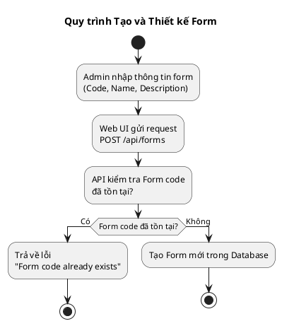

# 🚀 HƯỚNG DẪN NHANH - Generate PlantUML URL

## ⚡ Cách nhanh nhất (3 bước)

### Bước 1: Mở file .puml
Mở bất kỳ file nào trong thư mục `diagrams/`:
- `01-Tao-Thiet-Ke-Form.puml`
- `02-Dien-Luu-Du-Lieu.puml`
- `03-Xem-Sua-Du-Lieu.puml`
- `04-Tao-Version-Moi.puml`
- `05-Validate-Du-Lieu.puml`
- `06-Tong-Hop.puml`

### Bước 2: Copy toàn bộ code
- Chọn tất cả (Ctrl+A)
- Copy (Ctrl+C)

### Bước 3: Paste vào PlantUML Web
1. Mở trình duyệt: http://www.plantuml.com/plantuml/uml/
2. Paste code vào ô text (Ctrl+V)
3. Click nút **"Submit"** hoặc nhấn Enter
4. Xem sơ đồ!

---

## 🎯 Các cách khác

### Cách 1: Sử dụng Web Tool (Khuyến nghị)

1. Mở file `generate-plantuml-url.html` trong trình duyệt
2. Click vào diagram bạn muốn xem
3. Click "Load vào Editor" → Code sẽ hiển thị
4. Click "Mở PlantUML Web" → Trình duyệt sẽ mở PlantUML
5. Paste code vào và click Submit

### Cách 2: Sử dụng PowerShell Script

```powershell
# Chạy script (sẽ hiện menu)
cd "d:\ONENET\5.Test Performance\DynamicForm\DynamicForm\docs\diagrams"
.\generate-url.ps1

# Hoặc chỉ định file cụ thể
.\generate-url.ps1 01-Tao-Thiet-Ke-Form.puml
```

Script sẽ:
- ✅ Mở PlantUML Web Server trong trình duyệt
- ✅ Copy code vào clipboard
- ✅ Hiển thị code để bạn paste

---

## 📋 Ví dụ Code PlantUML



---

## 🔧 Export sang PNG/SVG

Sau khi xem sơ đồ trên PlantUML Web Server:

1. Click vào format muốn export:
   - **PNG** - Để chèn vào tài liệu
   - **SVG** - Vector, có thể scale
   - **ASCII Art** - Text format

2. Download file về máy

---

## ❓ Troubleshooting

### Lỗi: "Cannot decode"
- ✅ Kiểm tra code có đầy đủ `@startuml` và `@enduml`
- ✅ Kiểm tra encoding file là UTF-8
- ✅ Copy lại toàn bộ code, không thiếu ký tự

### Lỗi: "Syntax error"
- ✅ Kiểm tra cú pháp PlantUML
- ✅ Xem documentation: https://plantuml.com/activity-diagram-beta

### Script PowerShell không chạy
```powershell
# Cho phép chạy script
Set-ExecutionPolicy -ExecutionPolicy RemoteSigned -Scope CurrentUser
```

---

## 📚 Tài liệu tham khảo

- PlantUML Web: http://www.plantuml.com/plantuml/uml/
- PlantUML Docs: https://plantuml.com/
- Activity Diagram: https://plantuml.com/activity-diagram-beta

---

**Chúc bạn sử dụng thành công! 🎉**
