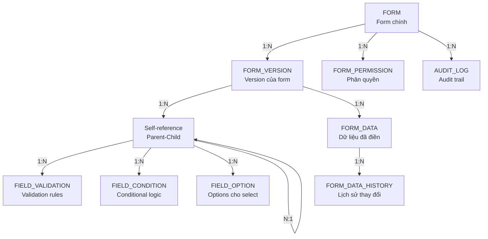

# SƠ ĐỒ QUAN HỆ DATABASE (ERD) - DYNAMIC FORM SYSTEM

## I. ERD TỔNG QUAN

### 1.1 Sơ đồ ERD tổng thể

```mermaid
erDiagram
    FORM ||--o{ FORM_VERSION : "has"
    FORM ||--o{ FORM_PERMISSION : "has"
    FORM_VERSION ||--o{ FORM_FIELD : "contains"
    FORM_VERSION ||--o{ FORM_DATA : "stores"
    FORM_FIELD ||--o{ FIELD_VALIDATION : "has"
    FORM_FIELD ||--o{ FIELD_CONDITION : "has"
    FORM_FIELD ||--o{ FIELD_OPTION : "has"
    FORM_DATA ||--o{ FORM_DATA_HISTORY : "has"
    FORM ||--o{ AUDIT_LOG : "tracks"
    
    FORM {
        Guid Id PK
        string Code UK
        string Name
        string Description
        int Status
        Guid CurrentVersionId FK
        DateTime CreatedDate
        string CreatedBy
        DateTime ModifiedDate
        string ModifiedBy
    }
    
    FORM_VERSION {
        Guid Id PK
        Guid FormId FK
        string Version
        bool IsActive
        DateTime CreatedDate
        string CreatedBy
        DateTime ApprovedDate
        string ApprovedBy
        string ChangeLog
    }
    
    FORM_FIELD {
        Guid Id PK
        Guid FormVersionId FK
        string FieldCode
        int FieldType
        string Label
        int DisplayOrder
        bool IsRequired
        bool IsVisible
        string DefaultValue
        string Placeholder
        string HelpText
        string CssClass
        string PropertiesJson
        Guid? ParentFieldId FK
        int? MinOccurs
        int? MaxOccurs
    }
    
    FIELD_VALIDATION {
        Guid Id PK
        Guid FieldId FK
        int RuleType
        string RuleValue
        string ErrorMessage
        int Priority
        bool IsActive
    }
    
    FIELD_CONDITION {
        Guid Id PK
        Guid FieldId FK
        int ConditionType
        string Expression
        string ActionsJson
        int Priority
    }
    
    FIELD_OPTION {
        Guid Id PK
        Guid FieldId FK
        string Value
        string Label
        int DisplayOrder
        bool IsDefault
    }
    
    FORM_DATA {
        Guid Id PK
        Guid FormVersionId FK
        string ObjectId
        string ObjectType
        string DataJson
        DateTime CreatedDate
        string CreatedBy
        DateTime ModifiedDate
        string ModifiedBy
        int Status
    }
    
    FORM_DATA_HISTORY {
        Guid Id PK
        Guid FormDataId FK
        string DataJson
        DateTime ChangedDate
        string ChangedBy
        string ChangeReason
    }
    
    FORM_PERMISSION {
        Guid Id PK
        Guid FormId FK
        string RoleCode
        int PermissionType
        bool CanView
        bool CanEdit
        bool CanDelete
        bool CanApprove
    }
    
    AUDIT_LOG {
        Guid Id PK
        string EntityType
        Guid EntityId
        string Action
        string OldValue
        string NewValue
        DateTime CreatedDate
        string CreatedBy
        string IpAddress
        string UserAgent
    }
```

## II. CHI TIẾT CÁC BẢNG

### 2.1 Bảng FORM

**Mục đích**: Lưu trữ thông tin form chính

| Cột | Kiểu dữ liệu | Ràng buộc | Mô tả |
|-----|--------------|-----------|-------|
| Id | Guid | PK, NOT NULL | Khóa chính |
| Code | nvarchar(50) | UK, NOT NULL | Mã form (VD: PHIEU_KHAM) |
| Name | nvarchar(200) | NOT NULL | Tên form |
| Description | nvarchar(500) | NULL | Mô tả form |
| Status | int | NOT NULL, DEFAULT 0 | Trạng thái (0=Draft, 1=Active, 2=Inactive) |
| CurrentVersionId | Guid | FK, NULL | Version hiện tại đang active |
| CreatedDate | DateTime | NOT NULL | Ngày tạo |
| CreatedBy | nvarchar(100) | NOT NULL | Người tạo |
| ModifiedDate | DateTime | NULL | Ngày sửa |
| ModifiedBy | nvarchar(100) | NULL | Người sửa |

**Indexes**:
- IX_FORM_Code (Code)
- IX_FORM_Status (Status)
- FK_FORM_CurrentVersionId (CurrentVersionId)

### 2.2 Bảng FORM_VERSION

**Mục đích**: Lưu trữ các version của form

| Cột | Kiểu dữ liệu | Ràng buộc | Mô tả |
|-----|--------------|-----------|-------|
| Id | Guid | PK, NOT NULL | Khóa chính |
| FormId | Guid | FK, NOT NULL | Khóa ngoại đến FORM |
| Version | nvarchar(20) | NOT NULL | Số version (VD: 1.0.0) |
| IsActive | bit | NOT NULL, DEFAULT 0 | Có đang active không |
| CreatedDate | DateTime | NOT NULL | Ngày tạo |
| CreatedBy | nvarchar(100) | NOT NULL | Người tạo |
| ApprovedDate | DateTime | NULL | Ngày duyệt |
| ApprovedBy | nvarchar(100) | NULL | Người duyệt |
| ChangeLog | nvarchar(1000) | NULL | Ghi chú thay đổi |

**Indexes**:
- IX_FORM_VERSION_FormId (FormId)
- IX_FORM_VERSION_IsActive (IsActive)
- UK_FORM_VERSION_FormId_Version (FormId, Version)

**Business Rules**:
- Version phải unique trong 1 form
- Chỉ có 1 version IsActive = true tại một thời điểm cho 1 form
- Version không thể sửa sau khi đã có data

### 2.3 Bảng FORM_FIELD

**Mục đích**: Lưu trữ các field trong form

| Cột | Kiểu dữ liệu | Ràng buộc | Mô tả |
|-----|--------------|-----------|-------|
| Id | Guid | PK, NOT NULL | Khóa chính |
| FormVersionId | Guid | FK, NOT NULL | Khóa ngoại đến FORM_VERSION |
| FieldCode | nvarchar(50) | NOT NULL | Mã field (VD: HO_TEN) |
| FieldType | int | NOT NULL | Loại field (1=Text, 2=Number, 3=Date, 4=Select, ...) |
| Label | nvarchar(200) | NOT NULL | Nhãn hiển thị |
| DisplayOrder | int | NOT NULL | Thứ tự hiển thị |
| IsRequired | bit | NOT NULL, DEFAULT 0 | Bắt buộc nhập |
| IsVisible | bit | NOT NULL, DEFAULT 1 | Có hiển thị không |
| DefaultValue | nvarchar(500) | NULL | Giá trị mặc định |
| Placeholder | nvarchar(200) | NULL | Placeholder text |
| HelpText | nvarchar(500) | NULL | Text hướng dẫn |
| CssClass | nvarchar(200) | NULL | CSS class tùy chỉnh |
| PropertiesJson | nvarchar(max) | NULL | Properties động (JSON) |
| ParentFieldId | Guid | FK, NULL | Field cha (cho nested/repeater) |
| MinOccurs | int | NULL | Số lần xuất hiện tối thiểu (repeater) |
| MaxOccurs | int | NULL | Số lần xuất hiện tối đa (repeater) |

**Indexes**:
- IX_FORM_FIELD_FormVersionId (FormVersionId)
- IX_FORM_FIELD_DisplayOrder (FormVersionId, DisplayOrder)
- UK_FORM_FIELD_FormVersionId_FieldCode (FormVersionId, FieldCode)
- FK_FORM_FIELD_ParentFieldId (ParentFieldId)

**FieldType Enum**:
- 1: Text
- 2: Number
- 3: Date
- 4: DateTime
- 5: Time
- 6: Select (Dropdown)
- 7: MultiSelect
- 8: Checkbox
- 9: Radio
- 10: TextArea
- 11: RichText
- 12: FileUpload
- 13: ImageUpload
- 14: Repeater (Dynamic list)
- 15: Section (Group fields)
- 16: Signature

### 2.4 Bảng FIELD_VALIDATION

**Mục đích**: Lưu trữ các rule validation cho field

| Cột | Kiểu dữ liệu | Ràng buộc | Mô tả |
|-----|--------------|-----------|-------|
| Id | Guid | PK, NOT NULL | Khóa chính |
| FieldId | Guid | FK, NOT NULL | Khóa ngoại đến FORM_FIELD |
| RuleType | int | NOT NULL | Loại rule (1=Required, 2=Min, 3=Max, 4=Range, 5=Regex, 6=Custom) |
| RuleValue | nvarchar(500) | NULL | Giá trị rule (JSON hoặc string) |
| ErrorMessage | nvarchar(500) | NOT NULL | Thông báo lỗi |
| Priority | int | NOT NULL, DEFAULT 0 | Độ ưu tiên (số nhỏ = ưu tiên cao) |
| IsActive | bit | NOT NULL, DEFAULT 1 | Có active không |

**Indexes**:
- IX_FIELD_VALIDATION_FieldId (FieldId)
- IX_FIELD_VALIDATION_Priority (FieldId, Priority)

**RuleType Examples**:
- Required: RuleValue = null
- Min: RuleValue = "10"
- Max: RuleValue = "100"
- Range: RuleValue = "{\"min\": 10, \"max\": 100}"
- Regex: RuleValue = "^[0-9]{10}$"
- Custom: RuleValue = "{\"function\": \"checkAge\"}"

### 2.5 Bảng FIELD_CONDITION

**Mục đích**: Lưu trữ điều kiện hiển thị/ẩn field

| Cột | Kiểu dữ liệu | Ràng buộc | Mô tả |
|-----|--------------|-----------|-------|
| Id | Guid | PK, NOT NULL | Khóa chính |
| FieldId | Guid | FK, NOT NULL | Khóa ngoại đến FORM_FIELD |
| ConditionType | int | NOT NULL | Loại điều kiện (1=Show, 2=Hide, 3=Enable, 4=Disable) |
| Expression | nvarchar(1000) | NOT NULL | Biểu thức điều kiện (JSON) |
| ActionsJson | nvarchar(max) | NULL | Actions khi condition đúng (JSON) |
| Priority | int | NOT NULL, DEFAULT 0 | Độ ưu tiên |

**Indexes**:
- IX_FIELD_CONDITION_FieldId (FieldId)

**Expression Example**:
```json
{
  "operator": "AND",
  "conditions": [
    {
      "field": "GIOI_TINH",
      "operator": "==",
      "value": "Nam"
    },
    {
      "field": "TUOI",
      "operator": ">",
      "value": 18
    }
  ]
}
```

### 2.6 Bảng FIELD_OPTION

**Mục đích**: Lưu trữ các option cho field Select/Radio/Checkbox

| Cột | Kiểu dữ liệu | Ràng buộc | Mô tả |
|-----|--------------|-----------|-------|
| Id | Guid | PK, NOT NULL | Khóa chính |
| FieldId | Guid | FK, NOT NULL | Khóa ngoại đến FORM_FIELD |
| Value | nvarchar(100) | NOT NULL | Giá trị option |
| Label | nvarchar(200) | NOT NULL | Nhãn hiển thị |
| DisplayOrder | int | NOT NULL | Thứ tự hiển thị |
| IsDefault | bit | NOT NULL, DEFAULT 0 | Có phải mặc định không |

**Indexes**:
- IX_FIELD_OPTION_FieldId (FieldId)
- IX_FIELD_OPTION_DisplayOrder (FieldId, DisplayOrder)

### 2.7 Bảng FORM_DATA

**Mục đích**: Lưu trữ dữ liệu đã điền của form

| Cột | Kiểu dữ liệu | Ràng buộc | Mô tả |
|-----|--------------|-----------|-------|
| Id | Guid | PK, NOT NULL | Khóa chính |
| FormVersionId | Guid | FK, NOT NULL | Khóa ngoại đến FORM_VERSION |
| ObjectId | nvarchar(100) | NOT NULL | ID đối tượng nghiệp vụ (VD: BenhAnId) |
| ObjectType | nvarchar(50) | NOT NULL | Loại đối tượng (VD: BENH_AN) |
| DataJson | nvarchar(max) | NOT NULL | Dữ liệu dạng JSON |
| CreatedDate | DateTime | NOT NULL | Ngày tạo |
| CreatedBy | nvarchar(100) | NOT NULL | Người tạo |
| ModifiedDate | DateTime | NULL | Ngày sửa |
| ModifiedBy | nvarchar(100) | NULL | Người sửa |
| Status | int | NOT NULL, DEFAULT 0 | Trạng thái (0=Draft, 1=Submitted, 2=Approved) |

**Indexes**:
- IX_FORM_DATA_FormVersionId (FormVersionId)
- IX_FORM_DATA_ObjectId (ObjectId, ObjectType)
- IX_FORM_DATA_CreatedDate (CreatedDate)
- IX_FORM_DATA_CreatedBy (CreatedBy)

**DataJson Structure Example**:
```json
{
  "HO_TEN": "Nguyễn Văn A",
  "TUOI": 25,
  "GIOI_TINH": "Nam",
  "HUYET_AP": {
    "SYSTOLIC": 120,
    "DIASTOLIC": 80
  },
  "CHAN_DOAN": "Cảm cúm"
}
```

### 2.8 Bảng FORM_DATA_HISTORY

**Mục đích**: Lưu trữ lịch sử thay đổi của form data

| Cột | Kiểu dữ liệu | Ràng buộc | Mô tả |
|-----|--------------|-----------|-------|
| Id | Guid | PK, NOT NULL | Khóa chính |
| FormDataId | Guid | FK, NOT NULL | Khóa ngoại đến FORM_DATA |
| DataJson | nvarchar(max) | NOT NULL | Dữ liệu tại thời điểm đó |
| ChangedDate | DateTime | NOT NULL | Ngày thay đổi |
| ChangedBy | nvarchar(100) | NOT NULL | Người thay đổi |
| ChangeReason | nvarchar(500) | NULL | Lý do thay đổi |

**Indexes**:
- IX_FORM_DATA_HISTORY_FormDataId (FormDataId)
- IX_FORM_DATA_HISTORY_ChangedDate (ChangedDate)

### 2.9 Bảng FORM_PERMISSION

**Mục đích**: Lưu trữ phân quyền truy cập form

| Cột | Kiểu dữ liệu | Ràng buộc | Mô tả |
|-----|--------------|-----------|-------|
| Id | Guid | PK, NOT NULL | Khóa chính |
| FormId | Guid | FK, NOT NULL | Khóa ngoại đến FORM |
| RoleCode | nvarchar(50) | NOT NULL | Mã role (VD: DOCTOR, NURSE) |
| PermissionType | int | NOT NULL | Loại permission (1=Form, 2=Field) |
| CanView | bit | NOT NULL, DEFAULT 1 | Có thể xem |
| CanEdit | bit | NOT NULL, DEFAULT 0 | Có thể sửa |
| CanDelete | bit | NOT NULL, DEFAULT 0 | Có thể xóa |
| CanApprove | bit | NOT NULL, DEFAULT 0 | Có thể duyệt |

**Indexes**:
- IX_FORM_PERMISSION_FormId (FormId)
- UK_FORM_PERMISSION_FormId_RoleCode (FormId, RoleCode)

### 2.10 Bảng AUDIT_LOG

**Mục đích**: Lưu trữ log audit cho mọi thay đổi

| Cột | Kiểu dữ liệu | Ràng buộc | Mô tả |
|-----|--------------|-----------|-------|
| Id | Guid | PK, NOT NULL | Khóa chính |
| EntityType | nvarchar(50) | NOT NULL | Loại entity (VD: FORM, FORM_VERSION) |
| EntityId | Guid | NOT NULL | ID của entity |
| Action | nvarchar(50) | NOT NULL | Hành động (CREATE, UPDATE, DELETE) |
| OldValue | nvarchar(max) | NULL | Giá trị cũ (JSON) |
| NewValue | nvarchar(max) | NULL | Giá trị mới (JSON) |
| CreatedDate | DateTime | NOT NULL | Ngày tạo log |
| CreatedBy | nvarchar(100) | NOT NULL | Người thực hiện |
| IpAddress | nvarchar(50) | NULL | IP address |
| UserAgent | nvarchar(500) | NULL | User agent |

**Indexes**:
- IX_AUDIT_LOG_EntityType_EntityId (EntityType, EntityId)
- IX_AUDIT_LOG_CreatedDate (CreatedDate)
- IX_AUDIT_LOG_CreatedBy (CreatedBy)

## III. QUAN HỆ GIỮA CÁC BẢNG

### 3.1 Sơ đồ quan hệ chi tiết



### 3.2 Ràng buộc tham chiếu (Foreign Keys)

| Bảng con | Cột FK | Bảng cha | Cột PK | On Delete | On Update |
|----------|--------|----------|--------|-----------|-----------|
| FORM_VERSION | FormId | FORM | Id | RESTRICT | CASCADE |
| FORM | CurrentVersionId | FORM_VERSION | Id | SET NULL | CASCADE |
| FORM_FIELD | FormVersionId | FORM_VERSION | Id | CASCADE | CASCADE |
| FORM_FIELD | ParentFieldId | FORM_FIELD | Id | SET NULL | CASCADE |
| FIELD_VALIDATION | FieldId | FORM_FIELD | Id | CASCADE | CASCADE |
| FIELD_CONDITION | FieldId | FORM_FIELD | Id | CASCADE | CASCADE |
| FIELD_OPTION | FieldId | FORM_FIELD | Id | CASCADE | CASCADE |
| FORM_DATA | FormVersionId | FORM_VERSION | Id | RESTRICT | CASCADE |
| FORM_DATA_HISTORY | FormDataId | FORM_DATA | Id | CASCADE | CASCADE |
| FORM_PERMISSION | FormId | FORM | Id | CASCADE | CASCADE |

## IV. INDEXES VÀ PERFORMANCE

### 4.1 Indexes quan trọng

```sql
-- Form lookup
CREATE INDEX IX_FORM_Code ON FORM(Code);
CREATE INDEX IX_FORM_Status ON FORM(Status);

-- Version lookup
CREATE INDEX IX_FORM_VERSION_FormId_IsActive ON FORM_VERSION(FormId, IsActive);

-- Field lookup
CREATE INDEX IX_FORM_FIELD_FormVersionId_DisplayOrder ON FORM_FIELD(FormVersionId, DisplayOrder);

-- Data lookup
CREATE INDEX IX_FORM_DATA_ObjectId_ObjectType ON FORM_DATA(ObjectId, ObjectType);
CREATE INDEX IX_FORM_DATA_CreatedDate ON FORM_DATA(CreatedDate DESC);

-- Audit lookup
CREATE INDEX IX_AUDIT_LOG_EntityType_EntityId_CreatedDate ON AUDIT_LOG(EntityType, EntityId, CreatedDate DESC);
```

### 4.2 Partitioning Strategy

- **FORM_DATA**: Partition theo CreatedDate (theo tháng)
- **AUDIT_LOG**: Partition theo CreatedDate (theo tháng)
- **FORM_DATA_HISTORY**: Partition theo ChangedDate (theo tháng)

## V. DATA TYPES VÀ CONSTRAINTS

### 5.1 Enum Values

**FormStatus**:
- 0: Draft
- 1: Active
- 2: Inactive
- 3: Archived

**FieldType**:
- 1: Text
- 2: Number
- 3: Date
- 4: DateTime
- 5: Time
- 6: Select
- 7: MultiSelect
- 8: Checkbox
- 9: Radio
- 10: TextArea
- 11: RichText
- 12: FileUpload
- 13: ImageUpload
- 14: Repeater
- 15: Section
- 16: Signature

**ValidationRuleType**:
- 1: Required
- 2: MinLength
- 3: MaxLength
- 4: Min
- 5: Max
- 6: Range
- 7: Regex
- 8: Email
- 9: Phone
- 10: Custom

**ConditionType**:
- 1: Show
- 2: Hide
- 3: Enable
- 4: Disable
- 5: SetValue
- 6: SetRequired

## VI. SAMPLE DATA

### 6.1 Sample Form

```sql
INSERT INTO FORM (Id, Code, Name, Description, Status, CreatedDate, CreatedBy)
VALUES 
('11111111-1111-1111-1111-111111111111', 'PHIEU_KHAM', 'Phiếu Khám Bệnh', 'Phiếu khám bệnh chuẩn', 1, GETDATE(), 'admin');
```

### 6.2 Sample Form Version

```sql
INSERT INTO FORM_VERSION (Id, FormId, Version, IsActive, CreatedDate, CreatedBy, ApprovedDate, ApprovedBy)
VALUES 
('22222222-2222-2222-2222-222222222222', '11111111-1111-1111-1111-111111111111', '1.0.0', 1, GETDATE(), 'admin', GETDATE(), 'admin');
```

### 6.3 Sample Form Field

```sql
INSERT INTO FORM_FIELD (Id, FormVersionId, FieldCode, FieldType, Label, DisplayOrder, IsRequired, IsVisible)
VALUES 
('33333333-3333-3333-3333-333333333333', '22222222-2222-2222-2222-222222222222', 'HO_TEN', 1, 'Họ và Tên', 1, 1, 1),
('44444444-4444-4444-4444-444444444444', '22222222-2222-2222-2222-222222222222', 'TUOI', 2, 'Tuổi', 2, 1, 1),
('55555555-5555-5555-5555-555555555555', '22222222-2222-2222-2222-222222222222', 'GIOI_TINH', 6, 'Giới tính', 3, 1, 1);
```