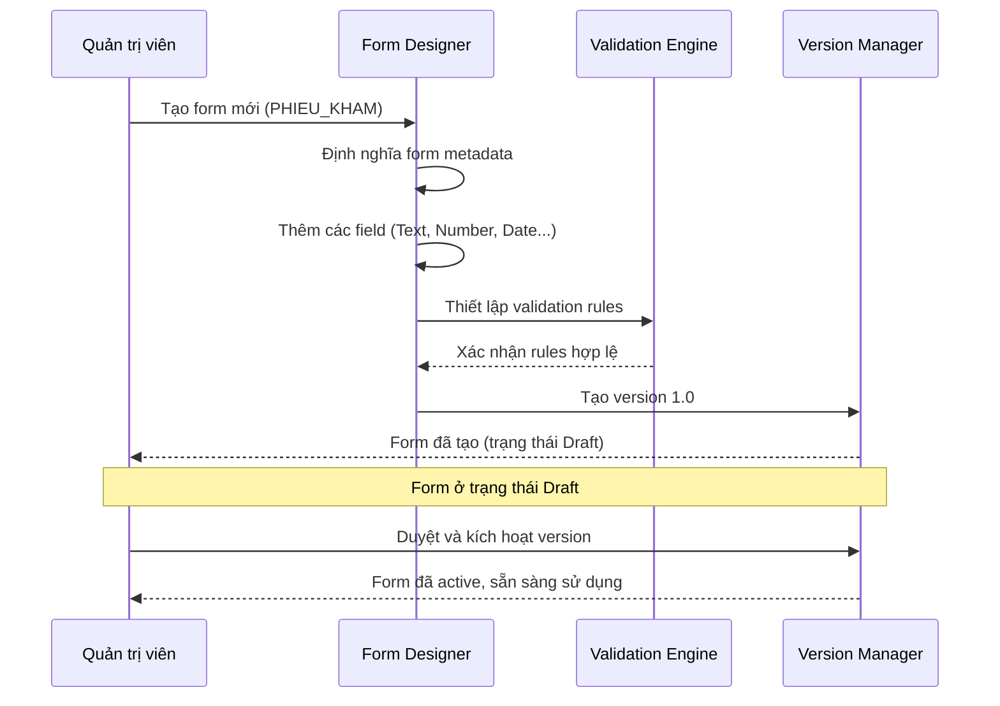
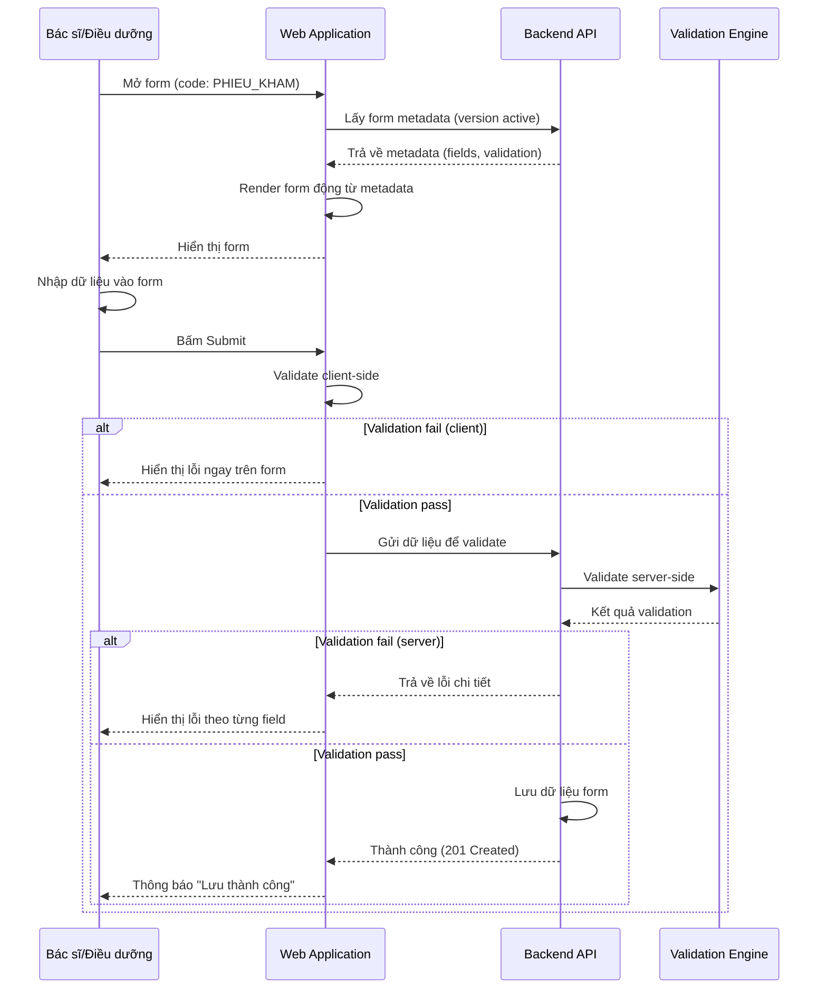
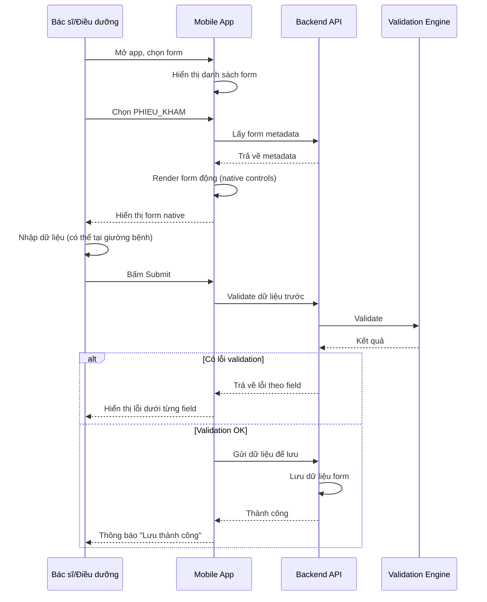
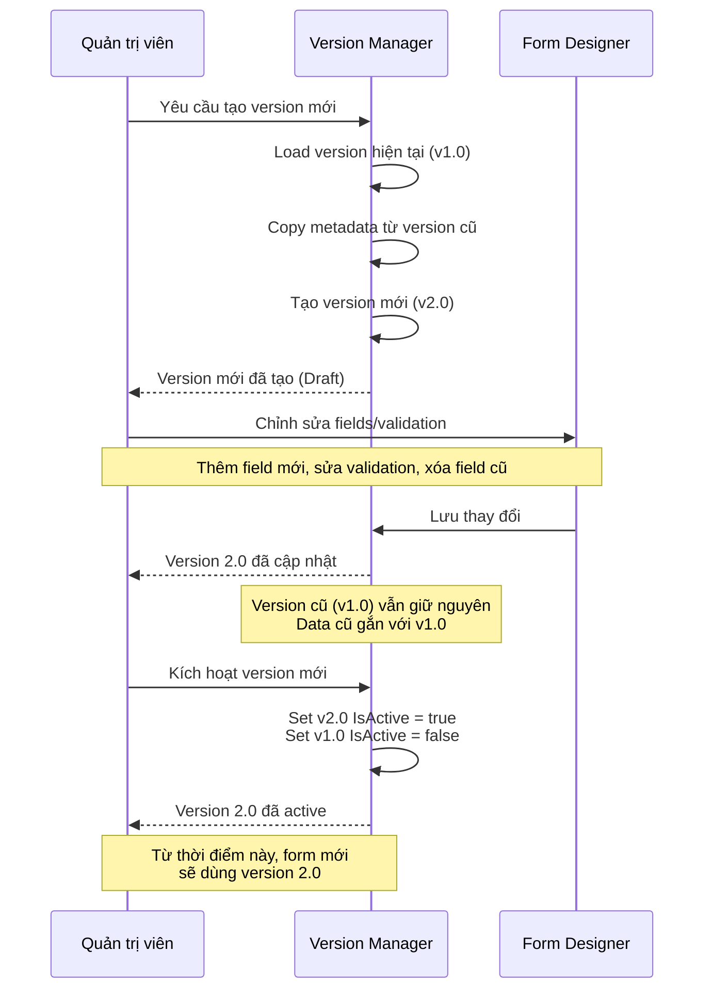
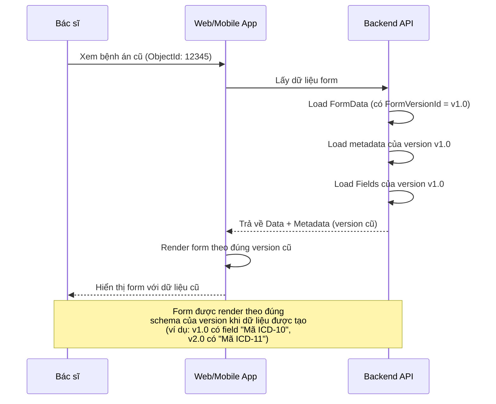
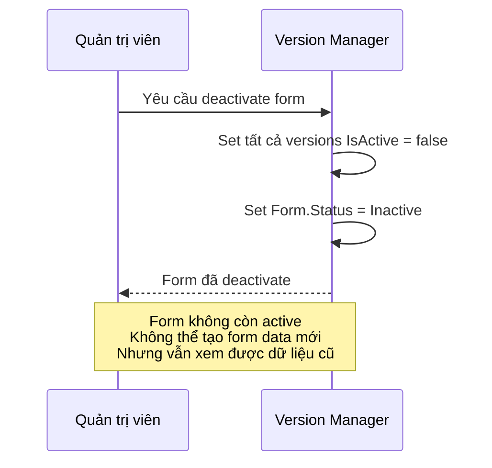

# LUỒNG NGHIỆP VỤ (BUSINESS FLOWS) - DYNAMIC FORM

> **Mục đích**: Tập trung vào các luồng nghiệp vụ chính, không bao gồm chi tiết kỹ thuật/database

---

## 1. LUỒNG TẠO VÀ QUẢN LÝ FORM (Admin)

---

## 2. LUỒNG ĐIỀN FORM - WEB (Bác sĩ/Điều dưỡng)

---

## 3. LUỒNG ĐIỀN FORM - MOBILE (Bác sĩ/Điều dưỡng)

---

## 4. LUỒNG TẠO VERSION MỚI (Admin)

---

## 5. LUỒNG XEM DỮ LIỆU FORM CŨ (Bác sĩ)

---

## 6. LUỒNG DEACTIVATE FORM (Admin)

---

## TÓM TẮT CÁC LUỒNG NGHIỆP VỤ

| Luồng | Actor | Mục đích | Kết quả |
|-------|-------|----------|---------|
| **Tạo Form** | Admin | Tạo form mới với metadata | Form ở trạng thái Draft |
| **Kích hoạt Form** | Admin | Duyệt và active form | Form sẵn sàng sử dụng |
| **Điền Form (Web)** | Doctor/Nurse | Nhập dữ liệu qua web | Dữ liệu được lưu |
| **Điền Form (Mobile)** | Doctor/Nurse | Nhập dữ liệu qua mobile | Dữ liệu được lưu |
| **Tạo Version Mới** | Admin | Cập nhật form theo quy định mới | Version mới, version cũ giữ nguyên |
| **Xem Dữ liệu Cũ** | Doctor | Xem bệnh án/form cũ | Hiển thị đúng theo version cũ |
| **Deactivate Form** | Admin | Ngừng sử dụng form | Form không còn active |

---

## LƯU Ý

- ✅ Tập trung vào **business logic**, không có chi tiết database
- ✅ Dễ hiểu cho **business stakeholders**
- ✅ Có thể dùng để **presentation cho lead**
- ✅ Có thể **export PNG** từ mermaid.live để chèn vào PowerPoint

---

**File này chỉ chứa business flows, không có technical details.**
