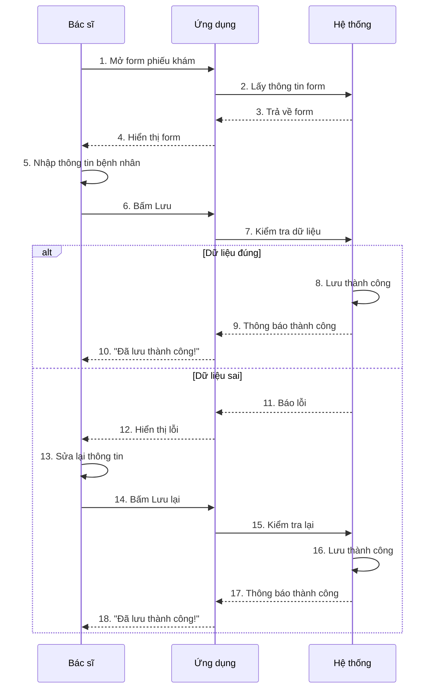
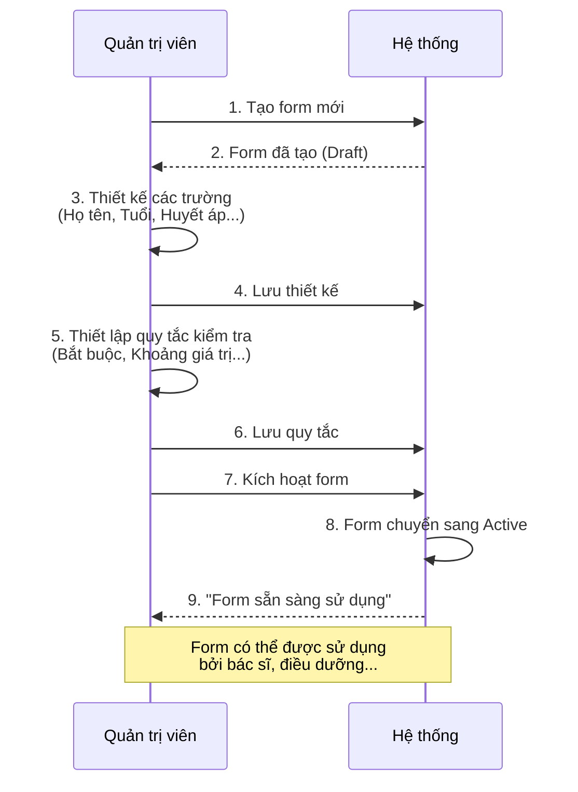
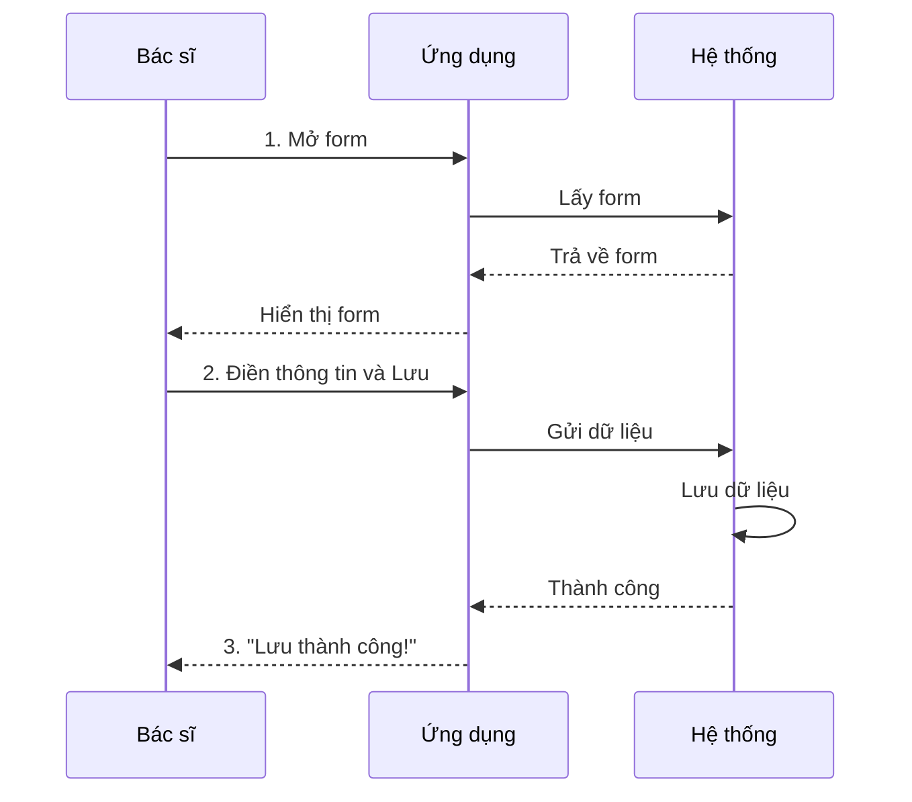
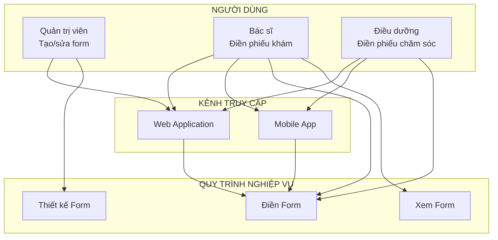
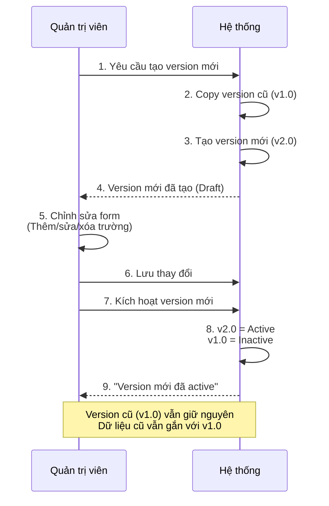

# CODE MERMAID SẴN SÀNG - PASTE VÀO MERMAID.AI

> **Cách dùng**: Copy code → Paste vào https://mermaid.ai/app/projects/ → Export

---

## CODE 1: Luồng Điền Form Đơn Giản (Đề xuất dùng)



---

## CODE 2: Luồng Tạo Form (Đơn giản)



---

## CODE 3: Luồng Cực Kỳ Đơn Giản (3 bước)



---

## CODE 4: Business Architecture Tổng Thể (Đơn giản)



---

## CODE 5: Luồng Tạo Version Mới (Đơn giản)



---

## CÁCH SỬ DỤNG

### Bước 1: Chọn code phù hợp
- Copy code Mermaid từ trên (bắt đầu từ ````mermaid` đến ````)

### Bước 2: Paste vào Mermaid.ai
1. Mở https://mermaid.ai/app/projects/
2. Tạo project mới hoặc mở project có sẵn
3. Paste code vào editor
4. Diagram sẽ tự động render

### Bước 3: Export
- Click nút Export → Chọn PNG/SVG/PDF
- Download và chèn vào PowerPoint

---

## GỢI Ý CHO THUYẾT TRÌNH

**Luồng đơn giản nhất để bắt đầu:**
- Dùng **CODE 3** (3 bước) - Cực kỳ đơn giản
- Hoặc **CODE 1** (Luồng điền form) - Đầy đủ hơn nhưng vẫn dễ hiểu

**Nếu cần tổng quan:**
- Dùng **CODE 4** (Business Architecture) - Tổng quan hệ thống

---

**Tất cả code đã sẵn sàng, chỉ cần copy-paste!**
